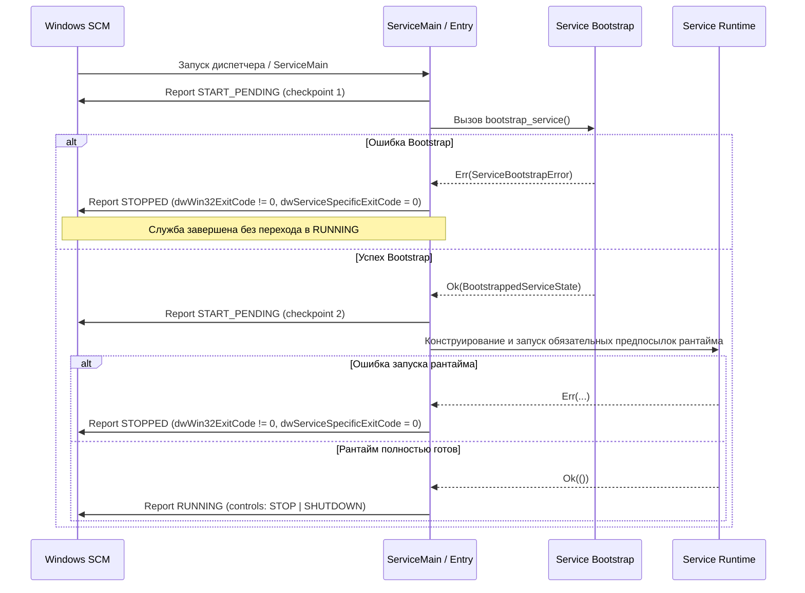

# Нормативный контракт инициализации сервиса (Service Bootstrap Contract V1)

Настоящий документ определяет нормативные требования к процедуре начальной загрузки и валидации авторитетного состояния службы `palka-service` (Service Bootstrap V1) перед запуском исполнительного рантайма и интеграцией с диспетчером Windows Service Control Manager (SCM).

Контракт является обязательным для проектирования, реализации и верификации модуля bootstrap в крейте `palka-service` и опирается на [Продуктовый контракт](./001-product-contract.md), [Доменный контракт](./002-domain-contract.md), [Контракт безопасности](./008-security-contract.md), [Контракт персистентности](./009-persistence-contract.md) и [Контракт жизненного цикла службы](./014-service-lifecycle-contract.md).

---

## 1. Архитектурная граница (Architectural Boundary)

**SERVICE BOOTSTRAP PREPARES AUTHORITATIVE STATE.**

Bootstrap является ограниченной по ответственности стартовой операцией подготовки и валидации авторитетного состояния службы.

### 1.1. Зона ответственности Bootstrap
Bootstrap выполняет и завершает исключительно следующие действия:
1. Проверка и обеспечение прав доступа к каноническому защищенному корню персистентности (`%ProgramData%\Palka`);
2. Декодирование и строгая валидация схемы канонических файлов конфигурации (`config.json`), учетных данных (`credentials.json`) и состояния домена (`state.json`);
3. Формирование валидированного типизированного снимка инициализированного состояния (`BootstrappedServiceState`) для передачи в подсистему оркестрации рантайма.

### 1.2. Исключения из зоны ответственности (Out of Scope)
Bootstrap **НЕ ДОЛЖЕН** (MUST NOT):
* Управлять диспетчером Windows SCM (`StartServiceCtrlDispatcherW`);
* Регистрировать обработчик управляющих сигналов SCM (`RegisterServiceCtrlHandlerExW`);
* Публиковать статусы службы в SCM (`SetServiceStatus`);
* Принимать или обрабатывать управляющие команды службы (`STOP`, `SHUTDOWN`, `INTERROGATE`);
* Выполнять установку, конфигурирование или удаление службы в SCM;
* Управлять фильтрацией трафика или правилами Windows Filtering Platform (WFP);
* Инициировать завершение работы или перезагрузку операционной системы;
* Запускать сетевые соединения, включая long polling или веб-хуки Telegram Bot API;
* Запускать слушатели локального межпроцессного взаимодействия (IPC) для UI/Tray;
* Запускать дочерние процессы или компоненты пользовательского интерфейса (Tray);
* Владеть и управлять долгоживущим циклом планировщика задач (Scheduler Loop).

Все перечисленные действия принадлежат последующим отдельным жизненным циклам службы и рантайма.

---

## 2. Канонические входные данные (Authoritative Inputs)

Процедура Bootstrap принимает строго канонические персистентные пути, сформированные в соответствии с [Контрактом персистентности](./009-persistence-contract.md):

1. **Канонический корень персистентности**:
   `%ProgramData%\Palka` (на уровне кода инкапсулируется в структуру `PersistentPaths`).
2. **Канонические файлы**:
   * `config.json` — каноническая конфигурация службы (содержит идентификатор ребенка `child_sid`, списки разрешенных пользователей `telegram_allowed_user_ids` и чатов `telegram_allowed_chat_ids`, интервал heartbeat);
   * `credentials.json` — каноническое хранилище учетных данных (хеш родительского PIN `pin_hash` и защищенный токен бота `telegram_bot_token_dpapi`);
   * `state.json` — каноническое персистентное состояние доменных таймеров, блокировок и очередей.

### 2.1. Ограничения на источники входных данных
* **Запрет произвольных путей**: Bootstrap **НЕ ДОЛЖЕН** читать файлы из текущей рабочей директории процесса (`Current Working Directory`), пользовательских профилей (`%USERPROFILE%`) или каталога исполняемого файла службы.
* **Запрет переопределений**: В версии V1 запрещены параметры командной строки и переменные окружения, переопределяющие пути к каноническим файлам конфигурации, учетных данных и состояния.
* **Запрет подмены по умолчанию**: При обнаружении поврежденного или невалидного канонического файла Bootstrap **НЕ ДОЛЖЕН** подменять его значениями по умолчанию («silent defaults fallback»).

---

## 3. Семантика защищенного корня (Persistent Root Semantics)

Bootstrap строго разделяет подготовку корня и загрузку канонических файлов:

1. **Подготовка корня (`root bootstrap & hardening`)**:
   * Вызов функции подготовки корня (`bootstrap_persistent_root`) проверяет существование директории `%ProgramData%\Palka` и обеспечивает применение ограничительного списка контроля доступа (Restricted Allow-List DACL):
     * `NT AUTHORITY\SYSTEM`: Full Control;
     * `BUILTIN\Administrators`: Full Control;
     * Обычные пользователи и непривилегированные процессы: доступ запрещен (отсутствие разрешающих ACE).
   * Если директория корня отсутствует, она создается с требуемым дескриптором безопасности.
   * Если директория уже существует, проверяется и корректируется её дескриптор безопасности.

2. **Запрет неявного создания файлов**:
   * Bootstrap сам по себе **НЕ ДОЛЖЕН** создавать отсутствующие `config.json`, `credentials.json` или `state.json`.
   * Создание и первоначальная подготовка этих файлов принадлежат отдельному явно авторизованному жизненному циклу развертывания/настройки (provisioning/setup), точный механизм которого находится вне рамок настоящего контракта (OUT OF SCOPE).

3. **Семантика отсутствия файлов**:
   * Если обязательные канонические файлы отсутствуют, операция загрузки завершается явной типизированной ошибкой отсутствия данных (fail-closed). Недопустимо создание состояния службы из частично отсутствующих файлов без явной авторизации контрактом.

---

## 4. Семантика загрузки конфигурации (Config Bootstrap Semantics)

Загрузка конфигурации выполняется через `ConfigFileStore` и модуль `config_persistence`:

1. **Строгая валидация схемы**:
   * Чтение выполняется строго из канонического пути `config.json`.
   * Поле `schema_version` должно быть строго равно `1` (`CONFIG_SCHEMA_VERSION_V1`). Любая иная версия схемы приводит к отказу инициализации.
   * Невалидный UTF-8, некорректный синтаксис JSON или несоответствие типов полей приводят к немедленному отказу инициализации.
   * Неизвестные или запрещенные поля отклоняются в соответствии с политикой строгой десериализации.
2. **Семантика отсутствия и автопочинки**:
   * Отсутствие `config.json` трактуется как состояние неинициализированной службы и приводит к ошибке загрузки конфигурации.
   * Bootstrap **НЕ ДОЛЖЕН** выполнять автоматическую модификацию, перезапись или починку поврежденного `config.json`.
   * Временные файлы замены (`.config.json.*.tmp`) не рассматриваются как источник авторитетных данных при повреждении канонического файла.

---

## 5. Семантика загрузки учетных данных (Credentials Bootstrap Semantics)

Загрузка учетных данных выполняется через `CredentialsFileStore` и модуль `credentials_persistence`:

1. **Строгая валидация схемы и данных**:
   * Чтение выполняется строго из канонического пути `credentials.json`.
   * Поле `schema_version` должно быть строго равно `1` (`CREDENTIALS_SCHEMA_VERSION_V1`).
   * Поле `pin_hash` должно содержать структурно валидную PHC-строку формата Argon2id (`$argon2id$...`), поддерживаемую модулем `credentials_persistence`. Нарушение формата PHC влечет отказ инициализации.
   * Поле `telegram_bot_token_dpapi` содержит токен бота в виде бинарного блоба, защищенного DPAPI (на платформе Windows), упакованного в каноническое строковое представление base64. Bootstrap проверяет наличие поля, синтаксическую валидность base64 и непустоту полученного блоба.
   * Списки разрешенных чатов и пользователей Telegram (`telegram_allowed_chat_ids`, `telegram_allowed_user_ids`) принадлежат `config.json`, хранятся в открытом виде в рамках канонической конфигурации и не подлежат защите DPAPI.
2. **Безопасность и аудит**:
   * Учетные данные, хеши и токены **НИКОГДА НЕ ДОЛЖНЫ** выводиться в журнал событий (логи), консоль или текст диагностических сообщений об ошибках.
   * Bootstrap **НЕ ДОЛЖЕН** выполнять интерактивную аутентификацию родителя или проверку PIN-кода; он выполняет только синтаксическую и структурную валидацию персистентного хранилища.
   * Bootstrap **НЕ ДОЛЖЕН** проверять точные параметры хеширования Argon2id (`m=65536, t=3, p=4`), возлагаемые на подсистему аутентификации при попытке ввода PIN.
   * Bootstrap **НЕ ДОЛЖЕН** вызывать операцию расшифровки Windows DPAPI unprotect в процессе загрузки; расшифровка и потребление токена выполняются позже подсистемой рантайма при инициализации Telegram-клиента. В структуру `BootstrappedServiceState` не помещаются токены в открытом виде.
   * Bootstrap **НЕ ДОЛЖЕН** автоматически пересоздавать или очищать учетные данные при ошибках их чтения.

---

## 6. Семантика загрузки состояния (State Bootstrap Semantics)

Загрузка состояния домена выполняется через `StateFileStore` и модуль `persistence`:

1. **Строгая валидация схемы и доменных инвариантов**:
   * Чтение выполняется строго из канонического пути `state.json`.
   * Поле `schema_version` должно быть строго равно `1` (`STATE_SCHEMA_VERSION_V1`).
   * Состояние валидируется на отсутствие дубликатов идентификаторов таймеров, некорректных временных меток и недопустимых сочетаний статусов домена согласно [Доменному контракту](./002-domain-contract.md).
   * Невалидное или поврежденное состояние влечет отказ инициализации (fail-closed).
2. **Отложенное исполнение доменной логики**:
   * Во время фазы Bootstrap **ЗАПРЕЩЕНО** вычислять просроченные таймеры, выполнять переход правил или инициировать принудительное завершение работы ОС.
   * Восстановление доменных решений («catch-up» / recovery evaluation) возлагается на последующий этап запуска доменного движка после успешного завершения Bootstrap.
   * Поврежденный `state.json` ни при каких обстоятельствах не заменяется пустым состоянием («empty state fallback»).

---

## 7. Результат успешной инициализации (Success Result)

При успешном выполнении всех фаз Bootstrap операция возвращает типизированную структуру:

```rust
pub struct BootstrappedServiceState {
    pub paths: PersistentPaths,
    pub config: PersistentConfig,
    pub credentials: PersistentCredentials,
    pub state: PersistentState,
}
```

### Свойства `BootstrappedServiceState`
* Структура содержит валидированный и согласованный снимок всех трех компонентов персистентности.
* Структура не содержит глобального разделяемого изменяемого состояния (никаких скрытых глобальных синглтонов).
* Структура не владеет дескрипторами Windows SCM или системными ресурсами, требующими специализированного закрытия.
* Экземпляр структуры передается по значению в подсистему оркестрации рантайма службы для конструирования рабочих компонентов.

---

## 8. Модель сбоев (Failure Model)

Все сбои инициализации типизируются и обрабатываются по принципу **FAIL-CLOSED**:

```rust
#[derive(Debug)]
pub enum ServiceBootstrapError {
    PersistentRoot(PersistentRootError),
    Config(ConfigStoreError),
    Credentials(CredentialsStoreError),
    State(StateStoreError),
}
```

### Требования к обработке сбоев
1. **Принцип «Все или ничего» (All-or-Nothing)**: При возникновении ошибки на любом из этапов частичный результат уничтожается. Службе не может быть передано половинчатое состояние (например, валидная конфигурация при невалидных учетных данных).
2. **Безопасность ошибок**: Тексты ошибок не должны содержать закрытых данных (токенов, хешей PIN, содержимого DPAPI).
3. **Запрет автопочинки**: Никакая ошибка загрузки файлов не должна приводить к автоматическому удалению или перезаписи поврежденного файла на диске в фазе Bootstrap.
4. **Отказ службы**: Любой сбой `ServiceBootstrapError` является фатальным для запуска службы.

---

## 9. Транзакционность и семантика частичной инициализации

Операция Bootstrap логически атомарна:

* Фаза 1: Подготовка корня (`bootstrap_persistent_root`). В случае ошибки — немедленный возврат `ServiceBootstrapError::PersistentRoot`.
* Фаза 2: Чтение `config.json`. В случае ошибки или отсутствия — немедленный возврат `ServiceBootstrapError::Config`.
* Фаза 3: Чтение `credentials.json`. В случае ошибки или отсутствия — немедленный возврат `ServiceBootstrapError::Credentials`.
* Фаза 4: Чтение `state.json`. В случае ошибки или отсутствия — немедленный возврат `ServiceBootstrapError::State`.
* Фаза 5: Агрегация в `BootstrappedServiceState` и возврат `Ok(...)`.

Если конфигурация и учетные данные загружены успешно, но чтение состояния завершилось ошибкой, распакованные объекты конфигурации и учетных данных отбрасываются и не становятся авторитетными для процесса.

---

## 10. Граница интеграции с Windows SCM (SCM Integration Boundary)

Интеграция с [Контрактом жизненного цикла службы](./014-service-lifecycle-contract.md) подчиняется строгому порядку фаз:



### Критическое правило статуса RUNNING
> [!IMPORTANT]
> Успешное выполнение Bootstrap является **необходимым, но недостаточным** условием для публикации статуса `SERVICE_RUNNING`.
> Служба **НЕ ИМЕЕТ ПРАВА** переходить в статус `SERVICE_RUNNING` до тех пор, пока все компоненты и предпосылки, классифицированные будущим контрактом оркестрации рантайма как обязательные, не будут успешно инициализированы.
> При этом отсутствие интернет-соединения (Internet connectivity) само по себе **НЕ ДОЛЖНО** блокировать запуск службы Windows или препятствовать переходу в `SERVICE_RUNNING`, поскольку сетевая доступность Telegram не является обязательным локальным условием принудительного исполнения правил.

---

## 11. Граница завершения работы (Shutdown Boundary)

Модуль Bootstrap функционирует исключительно на этапе старта службы.
* Bootstrap не содержит кода выгрузки или остановки службы.
* Bootstrap не перехватывает сигналы `SERVICE_CONTROL_STOP` или `SERVICE_CONTROL_SHUTDOWN`.
* Завершение работы, сохранение финального состояния в `state.json` и доклад `SERVICE_STOPPED` полностью управляются рантаймом службы и диспетчером SCM.

---

## 12. Безопасность и противодействие компрометации (Anti-Tamper)

1. **Контекст безопасности LocalSystem**:
   * Служба выполняется под учетной записью `NT AUTHORITY\SYSTEM`.
   * Bootstrap гарантирует, что каталог персистентности защищен от чтения и записи стандартными пользователями (детьми).
2. **Запрет атак через точки повторной обработки**:
   * Канонический защищенный корень `%ProgramData%\Palka` отклоняется, если на диске он оказывается точкой повторной обработки (reparse point / symlink / junction).
   * Защищенный дескриптор безопасности DACL корня наследуется всеми вновь создаваемыми дочерними объектами, исключая появление доступных ребенку источников конфигурации.
   * Bootstrap исключает использование любых альтернативных каталогов конфигурации или источников, контролируемых непривилегированным пользователем.
3. **Безопасность криптографических материалов**:
   * Ошибки парсинга хешей PIN или данных DPAPI не содержат фрагментов шифротекстов или ключевой информации.

---

## 13. Граница переносимости (Portability Boundary)

1. **Разделение платформенного и переносимого кода**:
   * Декодирование JSON и валидация структурных инвариантов `config.json`, `credentials.json`, `state.json` являются полностью переносимыми (pure Rust) и проверяются модульными тестами на всех поддерживаемых платформах.
   * Вызовы настройки дескрипторов безопасности Windows DACL (`palka-windows-platform::protected_directory`) изолированы под директивой `#[cfg(windows)]`.
2. **Честность тестовых свидетельств**:
   * Тесты на платформах, отличных от Windows, не должны симулировать или декларировать прохождение проверок Windows DACL.

---

## 14. Идентификаторы верификации (Verification Identifiers)

Для трассируемости контрактных требований вводится семейство идентификаторов верификации `BOOT-01` .. `BOOT-12`:

| Идентификатор | Описание проверяемого требования | Уровень свидетельств |
| :--- | :--- | :--- |
| **BOOT-01** | Формирование канонических путей `%ProgramData%\Palka` (`config.json`, `credentials.json`, `state.json`) без использования CWD | V1/V2 |
| **BOOT-02** | Успешная сквозная инициализация при наличии всех трех валидных канонических файлов | V2 (оркестрация с тестовыми зависимостями) / V3 (production bootstrap с защищенным корнем Windows) |
| **BOOT-03** | Сбой подготовки/защиты корня персистентности приводит к fail-closed отказу Bootstrap | V2/V3 |
| **BOOT-04** | Отсутствие `config.json` приводит к типизированному отказу `ServiceBootstrapError::Config` | V1/V2 |
| **BOOT-05** | Поврежденный или не соответствующий схеме V1 `config.json` отклоняется без автопочинки | V1/V2 |
| **BOOT-06** | Отсутствие `credentials.json`, нарушение схемы V1, структурно невалидный/неканонический PHC-хеш Argon2id, невалидный base64 или пустой блоб токена приводят к отказу `ServiceBootstrapError::Credentials` (без проверки расшифровки DPAPI или подбора PIN) | V1/V2 |
| **BOOT-07** | Отсутствие или доменная несогласованность `state.json` приводит к отказу `ServiceBootstrapError::State` без замены пустым состоянием | V1/V2 |
| **BOOT-08** | При частичной валидности файлов (например, валидные конфиг и креды, но поврежденный state) частичный успех отбрасывается (All-or-Nothing) | V1/V2 |
| **BOOT-09** | Никакая ошибка не инициирует автоматическую запись значений по умолчанию поверх существующих файлов | V1/V2 |
| **BOOT-10** | Диагностические сообщения и ошибки Bootstrap не содержат открытых секретов, токенов или фрагментов хешей PIN | V1/V2 |
| **BOOT-11** | Вызов Bootstrap не вызывает Win32 SCM API, не запускает сетевых/IPC соединений и не создает фоновых потоков | V1/V2 |
| **BOOT-12** | Успешный результат Bootstrap признается необходимым, но недостаточным условием для доклада статуса `SERVICE_RUNNING` | V1/V2 |

---

## 15. Дорожная карта реализации (Implementation Roadmap Boundary)

Декомпозиция дальнейших работ по внедрению службы:

1. **`SERVICE-BOOTSTRAP-IMPLEMENTATION`**:
   * Реализация изолированной публичной производственной функции `bootstrap_service() -> Result<BootstrappedServiceState, ServiceBootstrapError>`.
   * Внутренний вызов `bootstrap_persistent_root()` без приема произвольных пользовательских путей вызывающей стороны.
   * Покрытие модульными и интеграционными тестами `BOOT-01` .. `BOOT-12`.
2. **`SERVICE-RUNTIME-ORCHESTRATION`**:
   * Реализация конструктора долгоживущего рантайма службы из `BootstrappedServiceState`.
   * Инициализация подсистем таймеров, WFP, Telegram и локального IPC в соответствии с правилами обязательности.
   * Восстановление просроченных доменных решений.
3. **`SERVICE-SCM-EXECUTABLE-INTEGRATION`**:
   * Интеграция точки входа `crates/service/src/main.rs` с диспетчером `palka-windows-platform::scm_runtime`.
   * Реализация последовательности: `START_PENDING` -> `bootstrap_service()` -> запуск рантайма -> `RUNNING`.
   * Реализация graceful teardown при получении `STOP`/`SHUTDOWN`.
4. **`V3 SCM INTEGRATION`**:
   * Проведение интеграционных тестов в реальной среде Windows SCM.
5. **`V4 RECOVERY & SECURITY`**:
   * Комплексные испытания устойчивости при сбоях и ограничений прав стандартного пользователя.
