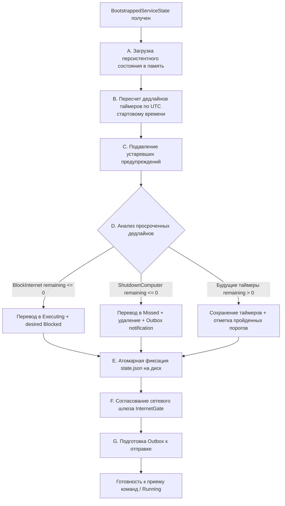

# Нормативный контракт оркестрации рантайма службы (Service Runtime Orchestration Contract V1)

Настоящий документ определяет нормативные требования к архитектуре, обязанностям, модели конкурентности, процедуре восстановления, планировщику, транзакционным гарантиям, управлению рабочими потоками и интерфейсам долгоживущего рантайма службы (`palka-service`).

Рантайм службы охватывает жизненный цикл, начинающийся непосредственно после успешного завершения [Контракта инициализации службы (Service Bootstrap V1)](./015-service-bootstrap-contract.md) и возврата валидированного объекта `BootstrappedServiceState`, и продолжающийся до завершения координированной остановки службы (`graceful teardown`). Интеграция точки входа исполняемого файла службы с диспетчером Windows Service Control Manager (SCM) специфицирована в [Контракте жизненного цикла службы](./014-service-lifecycle-contract.md) и вынесена в последующий отдельный жизненный цикл `SERVICE-SCM-EXECUTABLE-INTEGRATION`.

Контракт гармонизирует и объединяет требования [Продуктового контракта](./001-product-contract.md), [Доменного контракта](./002-domain-contract.md), [Контракта таймеров](./003-timer-contract.md), [Контракта IPC](./004-ipc-contract.md), [Контракта интернет-шлюза](./005-internet-gate-contract.md), [Контракта управления питанием](./006-power-contract.md), [Контракта Telegram](./007-telegram-contract.md), [Контракта безопасности](./008-security-contract.md), [Контракта персистентности](./009-persistence-contract.md), [Контракта тестирования](./010-test-contract.md) и [Архитектурного контракта](./architecture.md).

---

## 1. Центральный архитектурный инвариант (Core Architectural Invariant)

Система PALKA подчиняется базовому нормативному инварианту разделения ответственности:

```text
CORE DECIDES.
SERVICE ENFORCES.
PLATFORM EXECUTES.
TRAY DISPLAYS.
TELEGRAM REQUESTS.
```

Для долгоживущего рантайма службы настоящим контрактом дополнительно устанавливается системный закон:

```text
RUNTIME SERIALIZES AUTHORITATIVE MUTATION.
```

Рантайм службы (`Service Runtime`) является **единым авторитетным долгоживущим координатором** внутри процесса `palka-service`.
* Он потребляет предварительно валидированное состояние `BootstrappedServiceState`.
* Он владеет долгоживущей координацией вплоть до координированной остановки службы.
* Он **КАТЕГОРИЧЕСКИ НЕ ДОЛЖЕН (MUST NOT)** дублировать, искажать или подменять чистую доменную логику вычисления переходов и порогов, уже специфицированную в `palka-core`.
* Чистые решения принимает `palka-core`, рантайт службы сериализует их сохранение и координирует принудительное исполнение через абстрактные платформенные порты.

---

## 2. Границы ответственности рантайма (Runtime Responsibility Boundary)

### 2.1. Зона ответственности Runtime
Рантайм службы владеет и управляет исключительно следующими аспектами:
1. Авторитетное оперативное состояние в памяти, сконструированное из переданного `BootstrappedServiceState`;
2. Строгая последовательная сериализация всех операций, изменяющих авторитетное состояние;
3. Детерминированное процедурное восстановление при старте (`Startup Recovery`) после завершения bootstrap;
4. Оркестрация планировщика и таймеров на основе монотонного времени процесса;
5. Долговременные транзакционные переходы персистентного состояния (`state.json`);
6. Оркестрация платформенных побочных эффектов через абстрактные типизированные порты (`InternetGate`, `PowerController`);
7. Непрерывное согласование желаемой политики сети (`desired_internet_state`) и фактически наблюдаемого состояния шлюза (`observed_internet_state`);
8. Атомарная долговременная фиксация событий предупреждений (`emitted_thresholds`);
9. Управление долговременной очередью исходящих сообщений Telegram (`telegram_outbox`) с гарантией at-least-once доставки;
10. Формирование согласованных снимков состояния и здоровья (`StatusSnapshot`, `ServiceHealth`);
11. Координированная остановка и гарантированное присоединение (join) всех порожденных рабочих компонентов;
12. Возврат типизированного результата готовности (`Ready` / `Degraded` / `Fatal`) вызывающему слою интеграции с SCM.

### 2.2. Исключения из зоны ответственности Runtime (Out of Scope)
Рантайм службы **НЕ ВЛАДЕЕТ** и **НЕ ДОЛЖЕН (MUST NOT)** реализовывать:
* Системные вызовы диспетчеризации Windows SCM (`StartServiceCtrlDispatcherW`);
* Регистрацию системного обработчика управляющих сигналов (`RegisterServiceCtrlHandlerExW`);
* Прямую публикацию статусов службы в SCM (`SetServiceStatus`);
* Установку, удаление, изменение конфигурации или опрос SCM (`CreateServiceW`, `ChangeServiceConfigW`, `QueryServiceStatusEx`);
* Низкоуровневую реализацию фильтрации Windows Filtering Platform (WFP / `Fwpm*`);
* Низкоуровневые вызовы выключения операционной системы Windows (`ExitWindowsEx`, `InitiateSystemShutdownExW`);
* Реализацию сетевого HTTP-клиента Telegram Bot API или цикла опроса long-polling;
* Реализацию сервера именованных каналов Windows (Named Pipe IPC listener);
* Реализацию клиентского интерфейса трея (`tray`);
* Процедуру начального инсталлятора, создания защищенного корня или генерации канонических файлов `config.json`, `credentials.json`, `state.json`.

Все перечисленные аспекты относятся к отдельным жизненным циклам и изолированным платформенным/транспортным адаптерам.

---

## 3. Передача управления: Bootstrap -> Runtime (Handoff Sequence)

Процесс запуска службы Windows подчиняется строгой концептуальной последовательности:

```text
ServiceMain
  │
  ▼
SERVICE_START_PENDING (checkpoint 1)
  │
  ▼
bootstrap_service()
  │
  ├─► Err(ServiceBootstrapError) ──► STOPPED (exit code != 0)
  │
  ▼ Ok(BootstrappedServiceState)
SERVICE_START_PENDING (checkpoint 2)
  │
  ▼
Конструирование Service Runtime
  │
  ▼
Процедура восстановления (Startup Recovery)
  │
  ▼
Атомарная фиксация последствий восстановления на диск
  │
  ▼
Активация координатора и планировщика Runtime
  │
  ├─► Fatal Startup Failure ──► STOPPED (exit code != 0)
  │
  ▼
Возврат типизированного результата готовности (Ready / Degraded)
  │
  ▼
Слой интеграции SCM публикует SERVICE_RUNNING (controls: STOP | SHUTDOWN)
```

### Нормативное правило готовности службы:
> [!IMPORTANT]
> Успешное завершение `bootstrap_service()` является необходимым, но **КАТЕГОРИЧЕСКИ НЕДОСТАТОЧНЫМ** условием для перехода службы в статус `SERVICE_RUNNING`.
> Рантайм службы сам по себе **НЕ ВЫЗЫВАЕТ** `SetServiceStatus`. Он возвращает типизированный результат готовности вызывающей границе интеграции с исполняемым файлом SCM.
> Слой SCM-интеграции имеет право опубликовать статус `SERVICE_RUNNING` только после того, как рантайм успешно завершил процедуру восстановления, атомарно зафиксировал все необходимые восстановительные транзакции и активировал авторитетный координатор.

---

## 4. Модель единого источника авторитетных изменений (Single-Writer Authority Model)

Для предотвращения состояний гонки, повреждения снимков и рассинхронизации данных в V1 вводится фундаментальный инвариант конкурентности:

1. **Единый координатор изменений (Single-Writer Invariant)**:
   * Все модификации персистентного состояния `PersistentState` и его фиксация в `state.json` **ДОЛЖНЫ БЫТЬ СТРОГО СЕРИАЛИЗОВАНЫ** через единственный авторитетный исполнительный контекст (координатор / event-loop / актор).
   * Никакие два фоновых потока, воркера или адаптера не имеют права параллельно формировать, изменять или перезаписывать `state.json`.
2. **Запрет скрытого разделяемого изменяемого состояния**:
   * В рантайме службы запрещено использование глобальных статических изменяемых структур (`static mut`, глобальные `lazy_static`/`OnceLock` изменяемые контейнеры).
   * Состояние инкапсулируется внутри экземпляра координатора рантайма.
3. **Роль вспомогательных компонентов**:
   * Фоновые компоненты (планировщик, транспорты IPC и Telegram, наблюдатели платформы) имеют право:
     * отправлять строго типизированные доменные команды и события в очередь координатора;
     * запрашивать неизменяемые снимки состояния (`StatusSnapshot`);
     * выполнять явно санкционированные координатором платформенные операции.
   * Фоновые компоненты **НЕ ИМЕЮТ ПРАВА** самостоятельно принимать решения о модификации персистентных структур или публиковать файлы на диск.
4. **Запрет неконтролируемых фоновых задач**:
   * Создание detached-потоков («fire-and-forget»), не привязанных к жизненному циклу рантайма, категорически запрещено.
5. **Нейтральность к асинхронным фреймворкам**:
   * Настоящий контракт не навязывает обязательное использование Tokio или конкретного runtime асинхронности. Архитектурная модель требует детерминированной сериализации (концептуальный цикл обработки событий / актор), которая может быть реализована как через каналы стандартной библиотеки Rust (`std::sync::mpsc`), так и через асинхронные примитивы.

---

## 5. Разделение авторитетного персистентного и волатильного состояний

Рантайм строго разграничивает долговечные данные, сохраняемые на диске, и временные данные процесса:

### 5.1. Персистентный авторитет (Persistent Authority — `state.json`)
Строго соответствует схеме `PersistentState` v1 ([Контракт персистентности](./009-persistence-contract.md)):
* `desired_internet_state`: целевая сетевая политика (`Unrestricted` или `Blocked`);
* `active_actions`: список активных действий `ScheduledAction` (`Pending`, `Executing`, `Failed`);
* `internet_retry`: метаданные повторных попыток согласования платформы (`attempt_count`, `last_error`);
* `telegram_outbox`: долговременная очередь исходящих сообщений и системных уведомлений.

### 5.2. Волатильное состояние (Volatile / Re-derived State)
Сущности, принадлежащие исключительно оперативной памяти процесса службы и **КАТЕГОРИЧЕСКИ ЗАПРЕЩЕННЫЕ** к сохранению в `state.json`:
* `observed_internet_state`: фактически подтвержденное состояние шлюза (`InternetState`), опрашиваемое заново через `InternetGate::current_state`;
* `ShutdownState`: текущий статус управления питанием ОС (`Idle`, `Scheduled`, `InProgress`);
* Монотонные временные якоря (`Instant`), длительности тиков и интервалы сна;
* Метрики процесса (`uptime_seconds`);
* Дескрипторы системных каналов, потоков, воркеров и каналов межпоточного обмена;
* Состояния сетевых транспортных соединений Telegram и сессий клиентов IPC;
* Сессионные токены локальной аутентификации;
* Состояние сигнала отмены рантайма (`CancellationToken` / atomic shutdown flags).

---

## 6. Модель времени: Двойная шкала (Dual-Clock Semantics)

Для гарантированной защиты от рассинхронизации системного времени и надежного отсчета интервалов рантайм реализует модель двойных часов:

1. **Абсолютные дедлайны в UTC**:
   * Все персистируемые сроки наступления действий хранятся исключительно в виде абсолютных меток времени UTC (`UtcDateTime` / Unix timestamp в миллисекундах, `i64`).
   * При перезапуске службы расчет оставшегося времени производится исключительно на основе сохраненного UTC `Deadline` и текущего UTC-времени системы.
2. **Монотонный отсчет внутри сессии процесса**:
   * На протяжении непрерывной работы процесса службы отсчет интервалов ожидания, шагов планировщика и задержек повторных попыток управляется **строго монотонными часами ОС** (`std::time::Instant`).
   * Монотонные метки времени **НИКОГДА** не персистируются на диск.
3. **Устойчивость к переводу системных часов**:
   * Ручной или автоматический перевод системных часов Windows назад во время работы службы **НЕ МОЖЕТ** увеличить реальную длительность ожидания таймера.
   * Перевод часов Windows вперед во время работы службы **НЕ МОЖЕТ** вызвать преждевременное срабатывание дедлайна или повторную эмиссию предупреждений.
   * Достижение порогов предупреждений отслеживается по дискретной формуле `palka-core` и множеству `emitted_thresholds`.
4. **Инъекция времени в тестах**:
   * Все тесты времени рантайма обязаны использовать детерминированные абстрактные швы времени (инъекция монотонного времени и UTC-часов). Использование `std::thread::sleep` в модульных и контрактных тестах логики времени запрещено.

---

## 7. Процедура детерминированного восстановления при старте (Startup Recovery)

Немедленно после получения валидного `BootstrappedServiceState` рантайт службы обязан выполнить процедуру восстановления в строго определенном порядке:



### Порядок фаз восстановления:

* **Фаза A (Восстановление состояния в памяти)**:
  Инициализация внутренних структур координатора из сохраненного `PersistentState`.
* **Фаза B (Анализ временных меток)**:
  Определение текущего системного времени старта $T_{start}$ в шкале UTC. Вычисление остатка времени $R = \text{deadline} - T_{start}$ для каждого действия в `active_actions`.
* **Фаза C (Подавление ретроактивных предупреждений)**:
  Для каждого активного действия все пороги, удовлетворяющие условию $\text{threshold} \ge R$, маркируются как пройденные и заносятся в `emitted_thresholds` (согласно `palka_core::recovery_passed_thresholds`). Ретроактивные оповещения по порогам, наступившим во время недоступности службы, **КАТЕГОРИЧЕСКИ НЕ ГЕНЕРИРУЮТСЯ**.
* **Фаза D (Обработка просроченной блокировки Интернета — Overdue BlockInternet)**:
  Если для действия `BlockInternet` в статусе `Pending` дедлайн наступил во время недоступности службы ($R \le 0$):
  1. Действие переводится в состояние `ActionExecutionState::Executing`;
  2. Целевая политика `desired_internet_state` устанавливается в `DesiredInternetState::Blocked`;
  3. Изменения подготавливаются к обязательной предварительной персистентной фиксации;
  4. Устаревшие промежуточные предупреждения не генерируются.
* **Фаза E (Обработка просроченного выключения ПК — Overdue ShutdownComputer)**:
  Для **ЛЮБОГО** сохраненного на диске действия `ShutdownComputer` (`Pending`, `Executing` или `Failed`), чей дедлайн на момент старта службы уже наступил ($R \le 0$):
  1. Служба **КАТЕГОРИЧЕСКИ НЕ ДОЛЖНА (MUST NOT)** вызывать `PowerController::initiate_shutdown()`;
  2. Действие переводится в терминальный исход `ActionExecutionState::Missed` (согласно `palka_core::recovery_overdue_transition`);
  3. Действие удаляется из коллекции `active_actions`;
  4. В очередь `telegram_outbox` помещается системное уведомление родителю о пропущенном дедлайне (`MissedDeadlineOccurred` с уникальным `entry_id`);
  5. Волатильный статус питания `ShutdownState` инициализируется значением `ShutdownState::Idle`.
  *Обоснование*: Данное правило исключает циклическое непреднамеренное выключение свежезагруженной операционной системы.
* **Фаза F (Будущие таймеры)**:
  Действия с дедлайнами в будущем ($R > 0$) сохраняются в `active_actions`, регистрируются в планировщике, а оставшиеся непосещенными пороги сохраняют право на штатную генерацию.
* **Фаза G (Сохранение очереди сообщений Telegram)**:
  Все существующие валидные записи `telegram_outbox` полностью сохраняются. Ни одна запись не сбрасывается и не отбрасывается. Очередь становится доступной для фоновой отправки транспортом.
* **Фаза H (Атомарная фиксация результатов восстановления)**:
  Если в ходе фаз C, D, E состояние изменилось (были обновлены `emitted_thresholds`, удалено действие выключения, добавлено сообщение в `telegram_outbox` или изменена сетевая политика), координатор обязан выполнить **атомарную запись обновленного `state.json`** по протоколу замещения файлов.
* **Фаза I (Первичное согласование сетевого шлюза)**:
  Только после успешной персистентной фиксации сохраненная целевая политика `desired_internet_state` передается на согласование платформенному порту `InternetGate`. Наблюдаемое состояние сети опрашивается через `InternetGate::current_state`.

---

## 8. Барьер готовности рантайма (Startup Readiness Barrier)

Рантайм декларирует свою готовность вызывающему контексту только при соблюдении строгого набора инвариантов:

### 8.1. Условия достижения готовности
Рантайм **НЕ ИМЕЕТ ПРАВА** рапортовать о готовности до тех пор, пока:
1. `BootstrappedServiceState` успешно потреблен;
2. Все шаги процедуры восстановления (Startup Recovery) завершены без фатальных ошибок;
3. Все обязательные персистентные транзакции восстановления успешно записаны и сброшены на диск (`FlushFileBuffers`);
4. Внутренний координатор запущен и готов принимать события;
5. Каналы поступления управляющих сигналов готовы к работе;
6. Первичная попытка согласования `desired_internet_state` со шлюзом выполнена (даже если шлюз вернул ошибку, зафиксированную в статусе здоровья).

### 8.2. Градация состояний готовности
Рантайм возвращает строго типизированный статус готовности:
* **`Ready(HealthStatus::Healthy)`**: Рантайм полностью готов, хранилище целостно, все платформенные порты функционируют штатно.
* **`Ready(HealthStatus::Degraded)`**: Рантайм авторитетно функционирует и исполняет локальные ограничения, но обнаружены устранимые или внешние сбои (например: сетевой порт шлюза временно недоступен и перешел в режим повторов; отсутствует связь с серверами Telegram Bot API).
  * *Критический инвариант*: Недоступность сети Интернет или серверов Telegram **НЕ ЯВЛЯЕТСЯ** фатальным отказом и не должна препятствовать локальной готовности службы.
* **`Fatal(RuntimeConstructionFailure / StartupRecoveryFailure)`**: Неустранимый сбой восстановления или повреждение критических структур. Служба завершает процесс с ненулевым кодом выхода.

---

## 9. Сериализация команд и событий (Command & Event Ingress)

Все внешние и внутренние источники, инициирующие изменения состояния службы:
* Будущий локальный IPC от приложения трея;
* Будущий транспорт удаленного управления Telegram;
* Внутренний таймер планировщика;
* Фоновый воркер повторных попыток согласования сети;
* Процедура начального восстановления;

направляют свои запросы строго в виде типизированных замкнутых сообщений во входящую очередь авторитетного координатора.

### Правила обработки входящих команд:
1. **Запрет прямой модификации**: Транспортные адаптеры (IPC, Telegram) категорически не имеют доступа к изменяемым ссылкам на `PersistentState`.
2. **Замкнутый перечень операций**: Допустимы только команды, определенные в [Доменном контракте](./002-domain-contract.md) (`ScheduleInternetBlock`, `CancelInternetBlockTimer`, `RestoreInternet`, `ImmediateInternetBlock`, `ScheduleShutdown`, `CancelShutdownTimer`, `SendChildMessage`, `SendParentMessage`, `VerifyPin`, `QueryStatus`).
3. **Запрет системных команд**: В системе категорически отсутствуют команды выполнения произвольных системных утилит, запуска процессов, исполнения скриптов PowerShell или командной строки.
4. **Изоляция авторизации**: Проверка прав (соответствие Chat ID/User ID белому списку, валидация PIN-кода родителя) выполняется до передачи команды на исполнение состояния.

---

## 10. Транзакционное правило «Сначала персистентность, затем подтверждение» (Durable-Before-Ack)

Фундаментальный закон надежности службы PALKA:

> [!IMPORTANT]
> Если входящая операция или внутреннее событие изменяет персистентное состояние службы, успешное завершение операции **КАТЕГОРИЧЕСКИ НЕ ДОЛЖНО (MUST NOT)** подтверждаться инициатору до тех пор, пока обновленный снимок `state.json` не будет успешно и атомарно зафиксирован на стабильном носителе.

### Сценарии применения правила:
1. **Постановка таймера (`ScheduleInternetBlock`, `ScheduleShutdown`)**:
   Команда признается принятой, и клиенту возвращается подтверждение с `TimerId` **только после того**, как новая запись `ScheduledAction` в статусе `Pending` записана в `state.json`.
2. **Отмена таймера (`CancelInternetBlockTimer`, `CancelShutdownTimer`)**:
   Подтверждение отмены отправляется **только после** атомарного исключения действия из `state.json` на диске.
3. **Немедленная блокировка / разблокировка (`ImmediateInternetBlock`, `RestoreInternet`)**:
   Изменение `desired_internet_state` фиксируется на диске до отправки подтверждения клиенту.
4. **Сбой записи**:
   В случае ошибки ввода-вывода или сбоя диска операция отклоняется, клиенту возвращается ошибка, а память рантайма откатывается к последнему валидному персистентному состоянию.

---

## 11. Транзакционное правило «Сначала персистентность, затем побочный эффект» (Durable-Before-Side-Effect)

Для всех необратимых, внешних или критических побочных эффектов на платформе операционной системы порядок исполнения строго зафиксирован:

1. **Запланированная блокировка Интернета при дедлайне**:
   Наступление дедлайна $\to$ атомарная фиксация `execution_state = Executing` и `desired_internet_state = Blocked` в `state.json` $\to$ вызов `InternetGate::block_internet(child_sid)`.
2. **Немедленная блокировка Интернета**:
   Атомарная фиксация `desired_internet_state = Blocked` в `state.json` $\to$ вызов `InternetGate::block_internet(child_sid)`.
3. **Восстановление доступа к Интернету**:
   Атомарная фиксация `desired_internet_state = Unrestricted` в `state.json` $\to$ вызов `InternetGate::unblock_internet(child_sid)`.
4. **Выключение компьютера по дедлайну**:
   Наступление дедлайна $\to$ атомарная фиксация `execution_state = Executing` в `state.json` $\to$ системный вызов `PowerController::initiate_shutdown()`.

> [!CAUTION]
> Категорически запрещено сначала вызывать метод платформы, а затем пытаться зафиксировать намерение на диске.
> Нарушение порядка открывает критическое окно сбоя, при котором авария процесса после вызова платформы оставит систему с несинхронизированным состоянием на диске.

---

## 12. Оркестрация предупредительных уведомлений (Warning Orchestration)

Служба формирует предупреждения строго на 5 нормативных порогах: **60m**, **30m**, **20m**, **10m**, **3m**.

### Правила генерации и персистентности:
1. **Детерминированное вычисление**: Для определения наступления порогов используются чистые функции `palka_core::crossed_warning_thresholds` и `palka_core::creation_due_thresholds`.
2. **Однократность**: Для одного `TimerId` конкретный порог предупреждения может быть сгенерирован **не более одного раза**.
3. **Атомарная связка с очередью Outbox**:
   Генерация предупреждения состоит из двух неразрывных действий:
   * Добавление значения `WarningThreshold` в множество `emitted_thresholds` соответствующего таймера;
   * Постановка системного уведомления `ServiceNotification` (с новым уникальным `entry_id`) в `telegram_outbox`.
   Оба изменения **ДОЛЖНЫ БЫТЬ ЗАФИКСИРОВАНЫ В ЕДИНОМ СНИМКЕ `state.json`**.
4. **Запрет ретроактивных предупреждений**: Пороги, пройденные во время недоступности службы или при создании короткого таймера, маркируются в `emitted_thresholds` без генерации сообщений в `telegram_outbox`.

---

## 13. Модель планировщика событий (Event-Driven Wake Scheduler)

Планировщик рантайма службы не должен использовать непрерывный активный опрос (busy loop) или единый негибкий блокирующий сон:

1. **Событийно-управляемое пробуждение (Wake-Driven Scheduler)**:
   Планировщик вычисляет ближайший момент наступления следующего события и переходит в состояние ожидания с расчетным таймаутом.
   Событиями, прерывающими ожидание досрочно, являются:
   * Наступление расчетного времени следующего порога предупреждения;
   * Наступление дедлайна активного действия;
   * Поступление входящей команды или события от внешних интерфейсов;
   * Наступление времени очередной попытки согласования шлюза (`internet_retry`);
   * Получение сигнала остановки службы (`Stop`).
2. **Пересчет при мутациях**: После каждой принятой мутации состояния (добавление/отмена таймера) планировщик немедленно пересчитывает ближайший дедлайн пробуждения.
3. **Изоляция владения**: Планировщик не владеет собственной изменяемой копией `PersistentState`, а оперирует исключительно данными, предоставленными авторитетным координатором.

---

## 14. Согласование политики доступа к сети Интернет (Internet Reconciliation)

Система строго разделяет намерение службы и подтвержденный факт платформы:

```text
Желаемое состояние (DesiredInternetState) ──[Authority: state.json]
                    vs
Фактическое состояние (InternetState)       ──[Volatile: InternetGate::current_state()]
```

### 14.1. Допустимость расхождений
Рантайм обязан штатно представлять состояния рассинхронизации в `StatusSnapshot`:
* `desired = Blocked`, `observed = Unrestricted` (согласование в процессе или сбой шлюза);
* `desired = Unrestricted`, `observed = Blocked` (снятие блокировки в процессе или сбой шлюза).

### 14.2. Обработка отказов шлюза фильтрации
Если вызов `InternetGate::block_internet` или `unblock_internet` завершается ошибкой `Err(GateError)`:
1. Авторитетная целевая политика `desired_internet_state` **КАТЕГОРИЧЕСКИ НЕ ОТКАТЫВАЕТСЯ**;
2. Наблюдаемое состояние `observed_internet_state` фиксируется как `Unknown` или фактически возвращенное;
3. В `state.json` обновляются метаданные `internet_retry` (`attempt_count += 1`, `last_error = Some(...)`);
4. Интегральный статус здоровья службы деградирует (`HealthStatus::Degraded`);
5. В `telegram_outbox` помещается системное оповещение родителю о сбое согласования;
6. Планировщик ставит задачу на отложенную повторную попытку согласования.

---

## 15. Граница политики повторных попыток согласования сети (Internet Retry Policy Boundary)

Контракт персистентности сохраняет в `state.json` поля `attempt_count` и `last_error`, но оставляет алгоритм расчета интервалов за пределами базового формата данных.

### Нормативные требования к политике повторов V1 Runtime:
1. **Детерминированный шов политики (Retry Policy Seam)**:
   Конкретный алгоритм расчета задержек между попытками инкапсулируется в типизированный программный шов (`InternetRetryPolicy`).
2. **Запрет активного цикла (No Busy Retry)**:
   Повторные попытки категорически не должны выполняться в плотном цикле без задержки.
3. **Ограниченная задержка**:
   Интервалы повторов должны быть строго положительными ($> 0$) и ограниченными сверху (bounded backoff).
4. **Монотонное время повторов**:
   Расчет момента следующей попытки внутри текущего процесса опирается строго на монотонные часы.
5. **Поведение при перезапуске**:
   При старте процесса службы после перезапуска, если `desired_internet_state` не совпадает с `observed_internet_state` или присутствуют метаданные `internet_retry`, служба признает попытку немедленно подлежащей исполнению без ожидания истечения исторического монотонного таймаута предыдущего процесса.

Точные константы интервалов промышленной политики (минимальная задержка, множитель экспоненты, максимальный потолок) могут быть окончательно специфицированы в рамках последующего жизненного цикла принудительного исполнения сети `WINDOWS-INTERNET-GATE`.

---

## 16. Жизненный цикл исполнения выключения компьютера (Shutdown Runtime Execution)

Когда действие `ShutdownComputer` достигает дедлайна ($R \le 0$) во время непрерывной работы текущего рантайма:

1. **Фаза перехода к исполнению**:
   * Действие `Pending` переходит в `ActionExecutionState::Executing`;
   * Состояние `Executing` атомарно фиксируется в `state.json`;
   * Действие **НЕ УДАЛЯЕТСЯ** из `active_actions`.
2. **Фаза системного вызова**:
   * Только после подтверждения записи на диск вызывается `PowerController::initiate_shutdown()`.
3. **Исход А: Успешный прием платформой (`Ok(())`)**:
   * Означает, что Windows приняла запрос на выключение;
   * Волатильный статус питания рантайма переводится в `ShutdownState::InProgress` (на диск не сохраняется);
   * В доменном ядре действие переходит в терминальное состояние `ActionExecutionState::Completed`;
   * Терминальное действие удаляется из `active_actions`, и обновленный `state.json` атомарно сохраняется на диск.
4. **Исход Б: Ошибка платформенного вызова (`Err(PowerError)`)**:
   * Статус `ShutdownState::InProgress` **КАТЕГОРИЧЕСКИ НЕ УСТАНАВЛИВАЕТСЯ**;
   * Действие переходит в `ActionExecutionState::Failed { reason }`;
   * Состояние `Failed` фиксируется на диске с сохранением действия в `active_actions`;
   * Здоровье службы переводится в `HealthStatus::Degraded`;
   * В `telegram_outbox` ставится уведомление родителю об ошибке выключения.
   * *Примечание*: Если после этого служба перезапустится, сработает безопасное правило восстановления просроченных дедлайнов (Missed Deadline), и повторная попытка выключения производиться не будет.

---

## 17. Семантика долговременной очереди Telegram (Telegram Outbox Semantics)

Рантайм службы является единственным владельцем очереди `telegram_outbox`. Внешний сетевой транспорт Telegram Bot API не владеет очередью и подчиняется строгим правилам:

1. **Фиксация до отправки (Durable-Outbox-First)**:
   Любое исходящее сообщение (чат ребенка `Chat` со статусом `AcceptedByService` или оповещение `ServiceNotification`) надежно записывается в `state.json` **ДО** начала сетевого запроса к серверам Telegram.
2. **Адресация строго по `entry_id`**:
   Каждая запись очереди идентифицируется уникальным 128-битным `entry_id` (32 hex-символа в нижнем регистре).
3. **Удаление строго по подтверждению (Ack Removal)**:
   Запись удаляется из `telegram_outbox` **строго по ее точному `entry_id`** и только после получения подтверждения успешного приема сервером (`HTTP 200 OK`).
4. **Атомарность удаления**:
   Удаление подтвержденной записи из очереди фиксируется атомарным сохранением обновленного снимка `state.json`.
5. **Гарантия доставки**:
   Система обеспечивает гарантию **at-least-once delivery**. Потеря сообщений исключена. При аварии процесса между успешной отправкой в сеть и фиксацией удаления на диске сообщение будет повторно отправлено после перезапуска, что допускается проектным контрактом.
6. **Запрет прямой модификации транспортом**:
   Сетевой воркер Telegram не имеет права напрямую удалять элементы из файла или изменять структуру очереди в обход координатора рантайма.

---

## 18. Формирование снимка состояния и здоровья (Status & Health Snapshot)

Для внешних клиентов (UI трея, Telegram-команда `/status`, локальная диагностика) рантайм формирует согласованный снимок состояния `StatusSnapshot`:

```rust
pub struct StatusSnapshot {
    pub desired_internet_state: DesiredInternetState,
    pub observed_internet_state: InternetState,
    pub shutdown_state: ShutdownState,
    pub active_actions: Vec<ScheduledAction>,
    pub health: ServiceHealth,
    pub target_child_sid: String,
    pub timestamp: UtcDateTime,
}
```

### Инварианты снимка статуса:
* Формирование и чтение `StatusSnapshot` является строго **read-only** операцией и ни при каких условиях не модифицирует `PersistentState` и не производит записей на диск.
* Снимок предоставляет целостный срез данных, синхронизированный на момент формирования.
* Отображение и форматирование снимка в текст чата или элементы графического интерфейса является обязанностью клиентских адаптеров и не входит в рантайм.

---

## 19. Семантика управляемой остановки службы (Stop / Teardown Semantics)

Рантайм службы поддерживает координированную остановку (`graceful teardown`), инициируемую при получении авторизованного управляющего сигнала от SCM (`SERVICE_CONTROL_STOP` или `SERVICE_CONTROL_SHUTDOWN`).

### 19.1. Разграничение понятий
Необходимо четко различать:
* **Остановка службы (Service Stop / Teardown)**: штатное завершение процесса службы `palka-service.exe` операционной системой или администратором.
* **Выключение компьютера (ShutdownComputer)**: доменное действие принудительного обесточивания операционной системы по таймеру.

### 19.2. Процедура координированной остановки:
1. **Переход в режим остановки**:
   Рантайм выставляет флаг остановки и прекращает прием любых новых внешних команд, изменяющих состояние.
2. **Пробуждение и завершение воркеров**:
   Планировщик и все подчиненные фоновые задачи немедленно пробуждаются и переходят к завершению текущих циклов.
3. **Сохранение целостности домена**:
   * Рантайм **КАТЕГОРИЧЕСКИ НЕ ДОЛЖЕН (MUST NOT)** автоматически снимать сетевую блокировку при остановке службы. Состояние `desired_internet_state` остается прежним.
   * Рантайм **НЕ ДОЛЖЕН** отменять активные таймеры или сбрасывать `active_actions` только по причине остановки службы.
   * Рантайм **НЕ ДОЛЖЕН** очищать `telegram_outbox`.
4. **Гарантированное присоединение (Worker Join)**:
   Координатор ожидает завершения всех порожденных рабочих компонентов. Запрещается оставлять висящие или брошенные потоки.
5. **Финальная персистентность**:
   Поскольку рантайм соблюдает правило Durable-Before-Ack, состояние на диске в штатной ситуации уже является полностью зафиксированным. Однако если в оперативной памяти координатора на момент остановки присутствует незафиксированное изменение, выполняется его финальная атомарная запись на диск. Ошибка финальной записи возвращается как типизированная ошибка остановки (`TeardownFailure`).

---

## 20. Владение рабочими потоками и задачами (Worker Ownership & Failure Model)

Любой рабочий компонент (поток ОС или асинхронная задача), создаваемый рантаймом, подчиняется жестким правилам владения:

1. **Явный владелец**: Каждая задача имеет четкого родителя-владельца в лице координатора рантайма.
2. **Путь отмены**: Каждая задача удерживает канал приема сигнала остановки (`CancellationToken` / receiver).
3. **Путь завершения (Join Handle)**: Владелец удерживает дескриптор ожидания завершения (`JoinHandle`) и обязан выполнить `join()` при процедуре остановки.
4. **Наблюдаемость сбоев**: Паника или непредвиденное завершение любого подчиненного воркера должны быть обнаружены координатором, зафиксированы в статусе здоровья (`HealthStatus::Critical` или `Degraded`) и обработаны в соответствии с политикой отказоустойчивости.

---

## 21. Типовая таксономия ошибок (Failure Taxonomy)

Рантайм определяет строгую иерархию типизированных ошибок:

```rust
#[derive(Debug)]
pub enum ServiceRuntimeError {
    /// Ошибка конструирования рантайма из BootstrappedServiceState
    Construction(RuntimeConstructionError),
    /// Фатальный сбой процедуры начального восстановления
    StartupRecovery(StartupRecoveryError),
    /// Сбой подсистемы персистентности (атомарное замещение, сброс буферов)
    Persistence(StateStoreError),
    /// Ошибка платформенного адаптера (InternetGate, PowerController)
    Platform(PlatformError),
    /// Ошибка планировщика времени
    Scheduler(SchedulerError),
    /// Аварийное падение или отказ подчиненного воркера
    Worker(WorkerError),
    /// Сбой процедуры координированной остановки
    Teardown(TeardownError),
}
```

### Требования к безопасности ошибок:
* Ошибки рантайма категорически не должны содержать закрытых секретов (открытый PIN, токены Telegram, фрагменты DPAPI-блобов).
* Ошибки четко разделяются на фатальные для старта процесса службы и допустимые в режиме эксплуатационной деградации (`Degraded`).

---

## 22. Границы безопасности и непривилегированные интерфейсы (Security Boundary)

Рантайм службы выполняется в привилегированном контексте `LocalSystem` (`NT AUTHORITY\SYSTEM`):

1. **Недоверенный статус клиента Tray**:
   Процесс `palka-tray.exe` выполняется с правами стандартного пользователя и является недоверенным клиентом. Рантайм никогда не доверяет трею принятие решений и авторизацию.
2. **Защита от повышения привилегий**:
   Непривилегированный пользователь через интерфейс IPC может вызывать только разрешенные команды чтения статуса и отправки сообщений чата. Любые административные мутации требуют авторизации через родительский PIN-код.
3. **Защита секретов в оперативной памяти**:
   Секретные данные (PIN-код, расшифрованный токен Telegram) оборачиваются в структуры с гарантированной очисткой памяти при уничтожении (`zeroize`) и исключаются из форматирования журналов и снимков статуса.

---

## 23. Области, явно выходящие за рамки контракта (Explicitly Out of Scope)

Настоящий контракт оркестрации рантайма **ЯВНО И ОСОЗНАННО ИСКЛЮЧАЕТ** следующие компоненты и жизненные циклы:

1. **`SERVICE-SCM-EXECUTABLE-INTEGRATION`**:
   Интеграция точки входа исполняемого файла `crates/service/src/main.rs` с диспетчером `scm_runtime.rs`, системный цикл Windows Service и вызовы SCM API.
2. **`WINDOWS-INTERNET-GATE`**:
   Низкоуровневая реализация сетевой фильтрации на базе Windows Filtering Platform (WFP), драйверные фильтры, сублокации и разрыв соединений.
3. **`WINDOWS-POWER-CONTROLLER`**:
   Низкоуровневая реализация управления питанием Windows API (`InitiateSystemShutdownExW`, получение токена привилегий `SeShutdownPrivilege`).
4. **`TELEGRAM-TRANSPORT`**:
   Сетевой клиент Telegram Bot API, обработка HTTP-запросов, разбор веб-хуков/long polling и форматирование разметки сообщений.
5. **`IPC-TRANSPORT`**:
   Низкоуровневый сервер Named Pipe, системные дескрипторы безопасности канала, проверка токенов доступа клиента.
6. **`TRAY`**:
   Пользовательское приложение графического интерфейса в системном трее Windows.
7. **Инсталлятор и настройка**:
   Установщик MSI, первоначальная настройка и генерация файлов конфигурации.
8. **Тестовые уровни V3 и V4**:
   Сквозные интеграционные тесты на реальной Windows ОС и приемочные испытания устойчивости к саботажу (anti-tamper).

---

## 24. Граница будущей реализации кода (Immediate Implementation Boundary)

Непосредственно следующая за настоящим контрактом операция реализации ограничивается этапом:

```text
SERVICE-RUNTIME-ORCHESTRATION IMPLEMENTATION
```

В рамках реализации данного этапа:
* Разрешается создание сервисных абстракций рантайма, координатора, планировщика и детерминированных тестовых/фейковых портов платформы;
* **КАТЕГОРИЧЕСКИ ЗАПРЕЩАЕТСЯ** модифицировать и подключать файл `crates/service/src/main.rs` к Windows SCM. Файл `main.rs` остается нетронутым до старта отдельного авторизованного жизненного цикла `SERVICE-SCM-EXECUTABLE-INTEGRATION`.

---

## 25. Нормативная матрица верификации рантайма (Runtime Verification Matrix)

Для обеспечения сквозной трассируемости контрактных требований к рантайму устанавливается обязательная матрица верификации из 20 сценариев:

| Идентификатор | Требование и сценарий верификации | Уровень свидетельств |
| :--- | :--- | :--- |
| **RT-01** | Объект `BootstrappedServiceState` потребляется рантаймом по значению без повторного чтения с диска или альтернативных путей персистентности. | V1/V2 (Unit) |
| **RT-02** | Процедура восстановления при просроченном дедлайне `BlockInternet` (`remaining <= 0`) атомарно фиксирует `desired_internet_state = Blocked` и `execution_state = Executing` до вызова шлюза. | V1/V2 (Contract) |
| **RT-03** | Процедура восстановления при просроченном дедлайне `ShutdownComputer` (`remaining <= 0`) для состояний `Pending`, `Executing` или `Failed` ни при каких условиях не вызывает `PowerController::initiate_shutdown()`, применяет семантику `Missed`, удаляет действие из активных и ставит уведомление в outbox. | V1/V2 (Contract) |
| **RT-04** | Пороги предупреждений, наступившие во время недоступности службы, маркируются в `emitted_thresholds` как пройденные без генерации ретроактивных уведомлений в Telegram outbox. | V1/V2 (Contract) |
| **RT-05** | Достижение порога предупреждения приводит к атомарной и строго однократной фиксации добавления порога в `emitted_thresholds` и постановки уведомления `ServiceNotification` в `telegram_outbox` в рамках единого сохранения `state.json`. | V1/V2 (Contract) |
| **RT-06** | Команда немедленной блокировки (`ImmediateInternetBlock`) атомарно фиксирует `desired_internet_state = Blocked` в `state.json` до вызова платформенного шлюза. | V1/V2 (Contract) |
| **RT-07** | Команда снятия блокировки (`RestoreInternet`) атомарно фиксирует `desired_internet_state = Unrestricted` до вызова шлюза и ни при каких условиях не откатывает целевое состояние назад при ошибке шлюза. | V1/V2 (Contract) |
| **RT-08** | Наступление дедлайна запланированной блокировки Интернета атомарно фиксирует `execution_state = Executing` и `desired_internet_state = Blocked` до платформенного вызова `InternetGate::block_internet`. | V1/V2 (Contract) |
| **RT-09** | Успешное исполнение выключения компьютера по дедлайну во время работы рантайма следует строгой цепочке: фиксация `Executing` $\to$ платформенный `Ok(())` $\to$ установка волатильного `ShutdownState::InProgress` $\to$ терминальный переход `Completed` с удалением действия из `active_actions` на диске. | V1/V2 (Contract) |
| **RT-10** | Ошибка платформенного вызова при выключении компьютера фиксирует действие как `Failed { reason }` в `active_actions` на диске и категорически не устанавливает статус `ShutdownState::InProgress`. | V1/V2 (Contract) |
| **RT-11** | Сбой записи персистентного состояния до вызова побочного эффекта предотвращает платформенный вызов и возвращает ошибку инициатору команды. | V1/V2 (Contract) |
| **RT-12** | Конкурентная подача команд и событий из различных потоков/каналов сериализуется через единый авторитетный координатор без гонок и конкурентных записей `state.json`. | V1/V2 (Concurrency) |
| **RT-13** | Снимок статуса `StatusSnapshot` корректно и непротиворечиво представляет несовпадение желаемого и фактически подтвержденного состояний сети (`desired = Blocked`, `observed = Unrestricted` и наоборот). | V1/V2 (Contract) |
| **RT-14** | Использование монотонных часов в процессе работы рантайма предотвращает дублирование предупреждений и искажение дедлайнов при смещении системных часов Windows. | V1/V2 (Clock Seam) |
| **RT-15** | Активные будущие таймеры сохраняются в неизменном виде при штатной остановке службы и возобновляют работу после перезапуска. | V1/V2 (Contract) |
| **RT-16** | Штатная остановка службы категорически не снимает блокировку сети и не сбрасывает персистентное состояние `desired_internet_state`. | V1/V2 (Contract) |
| **RT-17** | После инициации координированной остановки (`stopping`) рантайм отклоняет все новые входящие запросы на мутацию состояния. | V1/V2 (Contract) |
| **RT-18** | При возврате из метода координированной остановки рантайма все порожденные подчиненные воркеры и фоновые задачи гарантированно завершены и присоединены (`joined`). | V1/V2 (Lifecycle) |
| **RT-19** | Рантайм декларирует статус готовности (`Ready`) только после успешного завершения всех фаз восстановления и подтверждения необходимых персистентных транзакций. | V1/V2 (Lifecycle) |
| **RT-20** | Записи `telegram_outbox` полностью сохраняются при перезапуске, а подтверждение доставки (`Ack`) удаляет из персистентного хранилища запись строго по ее точному `entry_id`. | V1/V2 (Contract) |

---

## 26. Уровни доказательности верификации (Test Levels Boundary)

* **Уровни V1 и V2 (Нормативный объем настоящего контракта)**:
  Полностью детерминированные модульные и контрактные тесты с использованием чистых структур Rust, тестовых дублеров (Fakes) для `InternetGate` и `PowerController`, виртуального монотонного времени и изоляции файловой системы через временные каталоги. Не требуют прав администратора Windows и взаимодействия с реальным Windows SCM API.
* **Будущий уровень V3 (Интеграция с платформой Windows)**:
  Тестирование на физической или виртуальной платформе Windows с реальными службами Windows SCM, драйвером WFP, сетевыми стеками и IPC Named Pipes.
* **Будущий уровень V4 (Приемочное тестирование безопасности и антисаботажа)**:
  Сквозное тестирование сценариев противодействия вмешательству от имени токена реального стандартного пользователя Windows (Child SID).

Реализация уровней V3 и V4 находится вне рамок настоящего документа и относится к последующим фазам жизненного цикла PALKA.
