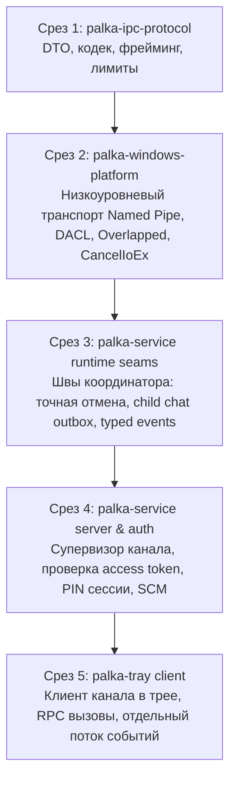

# Нормативный контракт реализации IPC V1 на основе именованных каналов Windows (IPC V1 Named Pipe Implementation Contract)

## 1. Статус документа и жизненный цикл (Document Status & Lifecycle)

```text
DOCUMENTATION_LIFECYCLE_STATUS=
IMPLEMENTED_LOCALLY_PENDING_INDEPENDENT_AUDIT

IPC_V1_STATUS=
DOCUMENTED_LOCALLY_NOT_FROZEN

IPC_IMPLEMENTATION_STATUS=
NOT_STARTED
```

> [!IMPORTANT]
> Настоящий документ представляет собой нормативный проект реализации протокола межпроцессного взаимодействия (IPC V1). Протокол и архитектура IPC V1 на текущий момент **НЕ ЯВЛЯЮТСЯ ЗАМОРОЖЕННЫМИ (NOT FROZEN)**, программная реализация IPC **НЕ НАЧАТА (NOT_STARTED)**, код каналов **НЕ РЕАЛИЗОВАН (NOT IMPLEMENTED)**, производственный IPC **НЕ ГОТОВ К ЭКСПЛУАТАЦИИ (NOT READY)** и физически на платформе Windows **НЕ ВЕРИФИЦИРОВАН (NOT PHYSICALLY VERIFIED)**.

---

## 2. Нормативное отношение к существующим контрактам (Relation to Existing Contracts)

1. **Отношение к [docs/004-ipc-contract.md](./004-ipc-contract.md)**:
   * Канонический документ [docs/004-ipc-contract.md](./004-ipc-contract.md) фиксирует продуктово-функциональный и высокоуровневый замысел безопасности взаимодействия привилегированной службы `palka-service` и пользовательского интерфейса `palka-tray`.
   * Настоящий документ `docs/021-ipc-named-pipe-implementation-contract.md` является более поздним нормативным контрактом технической реализации транспорта именованных каналов Windows (`Windows Named Pipe`), сервисного моста, авторизационной и сессионной модели, бинарного фрейминга, интеграции с диспетчером жизненного цикла Windows SCM и пошаговой декомпозиции внедрения.
   * В случаях, когда в [docs/004-ipc-contract.md](./004-ipc-contract.md) содержатся неоднозначности уровня реализации, которые данный документ явно разрешает, настоящий документ имеет преимущественную силу (`docs/021 controls for IPC V1 implementation`).
   * Настоящий документ **КАТЕГОРИЧЕСКИ НЕ ИМЕЕТ ПРАВА ОСЛАБЛЯТЬ** требования к безопасности, надежности и доменной целостности, установленные в [docs/001-product-contract.md](./001-product-contract.md), [docs/004-ipc-contract.md](./004-ipc-contract.md) и [docs/008-security-contract.md](./008-security-contract.md).

2. **Согласованность со связанными нормативными контрактами**:
   * [docs/002-domain-contract.md](./002-domain-contract.md) — остаётся авторитетным определением доменных типов: `ScheduledAction`, `TimerId`, `StatusSnapshot`, `DesiredInternetState`, `InternetState`, `ShutdownState`, `ServiceHealth`, `ChatMessage`, `Event`;
   * [docs/003-timer-contract.md](./003-timer-contract.md) — определяет семантику таймеров, дедлайнов и отмены действий;
   * [docs/007-telegram-contract.md](./007-telegram-contract.md) — определяет структуру телеметрии и очередь сообщений Telegram;
   * [docs/009-persistence-contract.md](./009-persistence-contract.md) — регламентирует атомарную персистентность `state.json`;
   * [docs/014-service-lifecycle-contract.md](./014-service-lifecycle-contract.md) — определяет общие фазы жизненного цикла службы;
   * [docs/016-service-runtime-orchestration-contract.md](./016-service-runtime-orchestration-contract.md) — фиксирует единый авторитетный координатор рантайма `ServiceRuntime`;
   * [docs/017-service-scm-executable-integration-contract.md](./017-service-scm-executable-integration-contract.md) — регламентирует диспетчер Windows SCM;
   * [docs/020-production-id-source-contract.md](./020-production-id-source-contract.md) — фиксирует контракт промышленного генератора идентификаторов (`Production IdSource`, blob `df5c0a80bb5ee4f913964f0a4835a111e9cccec5`). Статус документа: `NO_CHANGE`.

---

## 3. Общесистемный архитектурный инвариант (Architectural Invariant)

Интеграция IPC строго подчинена главному архитектурному закону системы PALKA:

```text
CORE DECIDES.
SERVICE ENFORCES.
PLATFORM EXECUTES.
TRAY DISPLAYS.
TELEGRAM REQUESTS.
RUNTIME SERIALIZES AUTHORITATIVE MUTATION.
```

### 3.1. Нормативные следствия инварианта для IPC:
1. **Процесс `tray` недоверен (Untrusted)**: графический интерфейс в пользовательской сессии рассматривается как потенциально скомпрометированный клиент;
2. **Транспорт IPC не является доменным авторитетом**: транспортные воркеры канала являются лишь адаптерами ввода-вывода и трансляторами протокола;
3. **Запрет прямого изменения персистентного состояния**: воркеры именованного канала **КАТЕГОРИЧЕСКИ НЕ ИМЕЮТ ПРАВА** напрямую читать или перезаписывать `state.json`;
4. **Запрет прямого вызова драйверов платформы**: воркеры именованного канала **КАТЕГОРИЧЕСКИ НЕ ИМЕЮТ ПРАВА** напрямую вызывать API сетевого фильтра WFP, подсистемы питания Windows Power или диспетчера служб SCM;
5. **Единая сериализация доменных мутаций**: все запросы на изменение доменного состояния транслируются в вызовы авторитетного координатора `ServiceRuntime` (через `RuntimeHandle`);
6. **Подчиненность IPC защитным функциям (Enforcement Supremacy)**: сбой IPC, крах процесса трея, отключение канала или переполнение буферов **НЕ МОГУТ ОСТАНОВИТЬ** исполнение активных таймеров, сетевых блокировок WFP или выключения компьютера;
7. **Независимость ядра**: крейт `palka-core` остаётся полностью независимым от деталей транспорта. В `palka-core` строго запрещено внедрять протокольные конверты, структуры кодека фреймов, DTO сериализации JSON или специфичные для Named Pipe структуры.

---

## 4. Разделение ответственности компонентов (Component Ownership)

| Компонент / Крейт | Роль и область ответственности | Допустимые зависимости |
| :--- | :--- | :--- |
| **`palka-ipc-protocol`**<br>`(crates/ipc-protocol)` | **SHARED_PROTOCOL_OWNER**.<br>Владеет строгими структурами wire-конвертов V1, типами DTO запросов/ответов/событий, кодеком фрейминга, контролем лимитов размеров фреймов до аллокации, стабильными кодами ошибок и конверсией в/из доменных типов. | `palka-core`, `serde`, `serde_json` |
| **`palka-windows-platform`**<br>`(crates/windows-platform)` | **LOW_LEVEL_WINDOWS_PIPE_OWNER**.<br>Владеет низкоуровневой работой с Win32 API: создание канала с `FILE_FLAG_OVERLAPPED`, дескрипторы безопасности DACL, флаг `PIPE_REJECT_REMOTE_CLIENTS`, имперсонация токена клиента, отмена ввода-вывода через `CancelIoEx`. Не содержит сервисной политики. | `windows` (Win32_System_Pipes, Win32_System_IO, Win32_Storage_FileSystem, Win32_Security) |
| **`palka-service`**<br>`(crates/service)` | **SERVICE_IPC_POLICY_OWNER**.<br>Владеет супервизором сервера IPC, авторизацией ролей клиентов, глобальной защитой от перебора PIN-кода, проверкой PIN-сессий, маршрутизацией запросов в `RuntimeHandle`, управлением подписчиками событий, деградацией и повтором запуска. | `palka-core`, `palka-ipc-protocol`, `palka-windows-platform` |
| **`palka-tray`**<br>`(crates/tray)` | **CLIENT_OWNER**.<br>Владеет клиентом IPC: установлением соединения с каналом, отправкой запросов и ожиданием ответов в режиме один-к-одному, отдельным соединением подписки на поток событий, отображением снимков состояния и обработкой неизвестных исходов при сбоях сети. | `palka-core`, `palka-ipc-protocol`, `palka-windows-platform` (для клиента канала) |
| **`palka-core`**<br>`(crates/core)` | **TRANSPORT-INDEPENDENT DOMAIN AUTHORITY**.<br>Не знает о существовании IPC, именованных каналов, JSON DTO, фрейминга или Windows API. | Зависимости транспорта **СТРОГО ЗАПРЕЩЕНЫ** |

---

## 5. Параметры именованного канала (Canonical Pipe Configuration)

```text
CANONICAL_PIPE_NAME = \\.\pipe\palka_ipc_v1
PIPE_TYPE = PIPE_TYPE_BYTE
PIPE_READ_MODE = PIPE_READMODE_BYTE
PIPE_WAIT_MODE = PIPE_WAIT
MAX_PIPE_INSTANCES = 4
REMOTE_CLIENT_POLICY = PIPE_REJECT_REMOTE_CLIENTS
CAPACITY_OVERFLOW_POLICY = REJECT_NEW_CONNECTION
```

1. **Режим передачи (Byte Mode)**:
   Канал создаётся строго как потоковый байтовый (`PIPE_TYPE_BYTE` / `PIPE_READMODE_BYTE`). Режим сообщений Win32 (`PIPE_TYPE_MESSAGE`) отвергнут в пользу явного детерминированного фрейминга на уровне протокола.
2. **Лимит экземпляров (Capacity)**:
   Максимальное число одновременных экземпляров канала ограничено `MAX_PIPE_INSTANCES = 4`. Это покрывает топологию трея (1 командное соединение + 1 соединение потока событий) с запасом на временное переподключение или локальный административный инструмент.
3. **Политика переполнения (Rejection)**:
   При попытке установить 5-е параллельное соединение сервер отвергает подключение (`REJECT_NEW_CONNECTION`). **Категорически запрещено** вытеснять или принудительно закрывать существующие активные соединения ради подключения нового клиента.
4. **Запрет удаленных подключений (Kernel Rejection)**:
   В вызов `CreateNamedPipeW` обязательно передается флаг `PIPE_REJECT_REMOTE_CLIENTS`. Это обеспечивает отказ на уровне драйвера ядра именованных каналов (`NPFS`) при любых попытках доступа по сети через SMB/RPC.

---

## 6. Требования к Windows API и фичам windows crate (Windows API Requirements)

Версия крейта в репозитории: `windows = "0.62.2"`.

Для реализации транспорта канала в крейт `crates/windows-platform/Cargo.toml` требуется добавить фичи:
1. **`Win32_System_Pipes`**:
   * `CreateNamedPipeW`, `ConnectNamedPipe`, `DisconnectNamedPipe`;
   * `ImpersonateNamedPipeClient`;
   * `GetNamedPipeClientProcessId`, `GetNamedPipeClientSessionId`;
   * Константы: `PIPE_ACCESS_DUPLEX`, `PIPE_TYPE_BYTE`, `PIPE_READMODE_BYTE`, `PIPE_WAIT`, `PIPE_REJECT_REMOTE_CLIENTS`, `PIPE_UNLIMITED_INSTANCES`.
2. **`Win32_System_IO`**:
   * Структура `OVERLAPPED`;
   * Функция `CancelIoEx`;
   * Функции завершения перекрывающегося ввода-вывода `GetOverlappedResult`, `HasOverlappedIoCompleted`.
3. **`Win32_Storage_FileSystem`** (уже присутствует в манифесте):
   * `ReadFile`, `WriteFile`, `CreateFileW`, `FILE_FLAG_OVERLAPPED`.

---

## 7. Модель перекрывающегося ввода-вывода и остановка службы (Overlapped I/O & SCM Teardown)

```text
FILE_FLAG_OVERLAPPED = REQUIRED
CANCELLATION_API = CancelIoEx
BLOCKING_PIPE_IO_WITHOUT_CANCELLATION_PATH = NO
```

1. **Отвержение `SetNamedPipeHandleState` как примитива отмены**:
   Формулировки, рассматривающие `SetNamedPipeHandleState` как инструмент прерывания или отмены ввода-вывода, являются технически неверными и отвергаются. Данный API предназначен исключительно для настройки режимов чтения и буферизации канала.
2. **Обязательность `FILE_FLAG_OVERLAPPED`**:
   Серверный дескриптор канала открывается с флагом `FILE_FLAG_OVERLAPPED`. Все потенциально блокирующие операции ввода-вывода (`ConnectNamedPipe`, `ReadFile`, `WriteFile`) выполняются строго по асинхронной схеме с использованием структуры `OVERLAPPED` и событий синхронизации (`ManualResetEvent`).
3. **Протокол остановки службы по сигналу SCM (`Graceful Stop Protocol`)**:
   При получении управляющего сигнала `SERVICE_CONTROL_STOP` или `SERVICE_CONTROL_SHUTDOWN` служба выполняет координированное завершение:
   * **Шаг 1**: Установка атомарного токена отмены IPC (`ipc_cancellation_token.cancel()`);
   * **Шаг 2**: Вызов `CancelIoEx(handle, null)` для каждого дескриптора активного экземпляра канала, прерывающий любые зависшие операции `ConnectNamedPipe`, `ReadFile` и `WriteFile`;
   * **Шаг 3**: Ожидание завершения отмененных операций, где код `ERROR_OPERATION_ABORTED` (Win32 995) обрабатывается как штатный путь остановки;
   * **Шаг 4**: Закрытие соединений через `DisconnectNamedPipe` и закрытие системных дескрипторов;
   * **Шаг 5**: Ожидание (`join`) завершения рабочих потоков IPC до вызова `ServiceRuntime::stop()`.
4. **Инвариант отсутствия зависаний**:
   Ни один поток службы не имеет права выполнять бесконечный синхронный блокирующий вызов Win32 Pipe API без гарантированного пути отмены.

---

## 8. Дескриптор безопасности и авторизация клиентов (Security Descriptor & Client Authorization)

### 8.1. Список контроля доступа (DACL) и защита прав ребенка
Канал создается с явным дескриптором безопасности (`SECURITY_DESCRIPTOR`), содержащим защищенный список контроля доступа (`DACL`):
* `NT AUTHORITY\SYSTEM`: Полный доступ (`FILE_ALL_ACCESS` / SDDL `(A;;FA;;;SY)`);
* `BUILTIN\Administrators`: Полный доступ (`FILE_ALL_ACCESS` / SDDL `(A;;FA;;;BA)`);
* `Configured Child SID`: Строго ограниченный доступ клиента канала в DACL ядра без права создания экземпляров (`CHILD_PIPE_DACL_ALLOWED_ACCESS_MASK = 0x00100083`);
* `Anonymous Logon`: Безусловный явный запрет (`Access Denied` / SDDL `(D;;GA;;;AN)`);
* `Network Logon`: Безусловный явный запрет (`Access Denied` / SDDL `(D;;GA;;;NU)`).

#### Устранение уязвимости создания экземпляров канала (Child Pipe Instance Creation Hazard):
В архитектуре Windows Named Pipe битовая маска `FILE_APPEND_DATA` (0x0004) совпадает с правом создания новых экземпляров канала `FILE_CREATE_PIPE_INSTANCE` (0x0004). Стандартные составные маски `GENERIC_WRITE`, `FILE_GENERIC_WRITE`, а также SDDL-псевдонимы `GW` и `FW` включают этот бит. Предоставление таких прав непривилегированному ребенку несет критическую уязвимость перехвата канала и создания фальшивых экземпляров.

Нормативные требования:
```text
CONFIGURED_CHILD_PIPE_INSTANCE_CREATION = DENY
CONFIGURED_CHILD_FILE_CREATE_PIPE_INSTANCE = NOT_GRANTED
CONFIGURED_CHILD_FILE_APPEND_DATA = NOT_GRANTED
CHILD_GENERIC_WRITE_USAGE = FORBIDDEN
CHILD_FILE_GENERIC_WRITE_USAGE = FORBIDDEN
CHILD_SDDL_GW_USAGE = FORBIDDEN
CHILD_SDDL_FW_USAGE = FORBIDDEN
```

#### Разделение масок доступа: серверный грант DACL против клиентского запроса CreateFileW:
Контракт строго разделяет:
1. **Права, предоставляемые сервером ребенку в дескрипторе безопасности DACL (`CHILD_PIPE_DACL_ALLOWED_ACCESS_MASK`)**;
2. **Права, явно запрашиваемые клиентом ребенка при вызове `CreateFileW` (`CHILD_PIPE_CLIENT_DESIRED_ACCESS_MASK`)**.

Эти маски **НЕ ТОЖДЕСТВЕННЫ** (`SERVER_DACL_GRANT != CLIENT_DESIRED_ACCESS`).

#### Обоснование асимметрии на основе физических свидетельств Windows Named Pipe:
Прямая верификация на реальном стенде Win32 API ядра Windows установила:
* Клиентский вызов `CreateFileW` со строго минимальной маской `dwDesiredAccess = 0x00000003` (`FILE_READ_DATA | FILE_WRITE_DATA`) и флагом `FILE_FLAG_OVERLAPPED` успешно открывает канал, если DACL объекта канала ядра предоставляет системные права, необходимые подсистеме ввода-вывода Windows для подключения;
* Двунаправленный асинхронный перекрывающийся ввод-вывод (`Client -> Server` и `Server -> Client`) полностью успешен через структуры `OVERLAPPED` с явными дескрипторами событий `hEvent`;
* Системный вызов `CancelIoEx` на клиентском дескрипторе работает штатно;
* Вызов `SetNamedPipeHandleState` со стороны клиента не требуется (`CLIENT_SET_NAMED_PIPE_HANDLE_STATE_REQUIRED = NO`), так как канал изначально создается сервером как `PIPE_TYPE_BYTE | PIPE_READMODE_BYTE`;
* Право `READ_CONTROL` клиенту не требуется (`CLIENT_READ_CONTROL_REQUIRED = NO`), так как клиенту `palka-tray` не требуется считывать дескриптор безопасности канала;
* Право `SYNCHRONIZE` на уровне клиентского запроса `CreateFileW` явно запрашивать не требуется (`CLIENT_SYNCHRONIZE_ACCESS_REQUIRED_FOR_OVERLAPPED_IO = NO`), поскольку асинхронное ожидание осуществляется на дескрипторах событий `hEvent`;
* Однако на стороне сервера драйвер файловой системы именованных каналов ядра (`NPFS`) при создании клиентского дескриптора проверяет наличие у вызывающего прав `FILE_READ_ATTRIBUTES` (0x00000080) и `SYNCHRONIZE` (0x00100000). Если серверный DACL ограничен только правами `0x00000003`, ядро Windows завершает `CreateFileW` отказом в доступе (`ERROR_ACCESS_DENIED` / код 5);
* Минимально доказанным и достаточным серверным грантом в DACL является маска `0x00100083`.

Явные маски доступа:
* **`CHILD_PIPE_DACL_ALLOWED_ACCESS_MASK = 0x00100083`** (грант в DACL сервера ядра):
  - `FILE_READ_DATA` (0x00000001) — чтение ответов и событий;
  - `FILE_WRITE_DATA` (0x00000002) — запись запросов;
  - `FILE_READ_ATTRIBUTES` (0x00000080) — системное чтение атрибутов канала ядром при подключении;
  - `SYNCHRONIZE` (0x00100000) — системная поддержка синхронизации ядра Windows.
* **Запрещенные и непредоставляемые права в серверном DACL ребенка**:
  - `CHILD_PIPE_DACL_FILE_CREATE_PIPE_INSTANCE = NOT_GRANTED` (0x00000004);
  - `CHILD_PIPE_DACL_FILE_APPEND_DATA = NOT_GRANTED` (0x00000004);
  - `CHILD_PIPE_DACL_FILE_WRITE_ATTRIBUTES = NOT_GRANTED` (0x00000100);
  - `CHILD_PIPE_DACL_READ_CONTROL = NOT_GRANTED` (0x00020000);
  - `CHILD_PIPE_FORBIDDEN_ACCESS_MASK = 0x00000004 (FILE_CREATE_PIPE_INSTANCE / FILE_APPEND_DATA), WRITE_DAC (0x00040000), WRITE_OWNER (0x00080000), DELETE (0x00010000), GENERIC_ALL, GENERIC_WRITE`.

Канонический защищенный SDDL-шаблон:
```text
D:P(D;;GA;;;AN)(D;;GA;;;NU)(A;;FA;;;SY)(A;;FA;;;BA)(A;;0x100083;;;{child_sid})
```
Где:
* `D:P` — защищенный DACL (`SE_DACL_PROTECTED`), отключающий наследование от родительского каталога;
* `(D;;GA;;;AN)` — явный отказ анонимным подключениям;
* `(D;;GA;;;NU)` — явный отказ сетевым подключениям;
* `(A;;FA;;;SY)` — полный доступ LocalSystem;
* `(A;;FA;;;BA)` — полный доступ Builtin Administrators;
* `(A;;0x100083;;;{child_sid})` — явный доступ ребенка строго по минимально доказанной маске `CHILD_PIPE_DACL_ALLOWED_ACCESS_MASK`.

#### Точная маска DesiredAccess для клиента ребенка при вызове CreateFileW:
Так как защищенный DACL сервера намеренно исключает `GENERIC_WRITE`, `FILE_GENERIC_WRITE`, `FILE_APPEND_DATA` и `FILE_CREATE_PIPE_INSTANCE`, клиентский модуль ребенка (`palka-tray`) **НЕ ИМЕЕТ ПРАВА** открывать канал с использованием составного флага `GENERIC_READ | GENERIC_WRITE`. Вызов с `GENERIC_WRITE` приведет к ошибке `ERROR_ACCESS_DENIED` на уровне ядра.

Клиент ребенка обязан открывать канал вызовом `CreateFileW` со строго минимальной специфической маской прав на передачу данных:
```text
CHILD_PIPE_CLIENT_DESIRED_ACCESS_MASK = 0x00000003
CHILD_PIPE_CLIENT_GENERIC_READ = NOT_REQUIRED
CHILD_PIPE_CLIENT_GENERIC_WRITE = FORBIDDEN
CHILD_PIPE_CLIENT_FILE_CREATE_PIPE_INSTANCE = NOT_REQUESTED
CHILD_PIPE_CLIENT_FILE_APPEND_DATA = NOT_REQUESTED
CHILD_PIPE_CLIENT_FILE_READ_ATTRIBUTES = NOT_REQUESTED
CHILD_PIPE_CLIENT_FILE_WRITE_ATTRIBUTES = NOT_REQUESTED
CHILD_PIPE_CLIENT_READ_CONTROL = NOT_REQUESTED
CHILD_PIPE_CLIENT_SYNCHRONIZE = NOT_REQUESTED
CLIENT_OVERLAPPED_FLAG = FILE_FLAG_OVERLAPPED
SERVER_DACL_CLIENT_MASK_EQUAL = NO
```
Декомпозиция клиентской маски:
* `FILE_READ_DATA` (0x00000001) — чтение ответов и событий;
* `FILE_WRITE_DATA` (0x00000002) — отправка запросов.

Асинхронный режим запрашивается отдельно через флаг `dwFlagsAndAttributes = FILE_FLAG_OVERLAPPED`.

#### Обязательность Child SID и валидация против SDDL-инъекций:
```text
CHILD_SID_REQUIRED = YES
RAW_SID_DIRECT_SDDL_INTERPOLATION = FORBIDDEN
```
1. **Обязательность для боевого канала**: Для создания канонического боевого канала `\\.\pipe\palka_ipc_v1` параметр `child_sid` является строго обязательным (`ValidatedSid` / `ConfiguredChildSid` или обязательный `&str`, проверяемый немедленно). Использование `Option<&str>` как штатного контракта боевого канала запрещено. При отсутствии, пустоте или невалидности SID создание канала завершается ошибкой (`Fail-Closed`). Никаких fallback DACL или создания канала без ACE ребенка не допускается.
2. **Валидация через Win32 API**: Простой проверки префикса `S-1-` недостаточно. Входная строка SID обязана валидироваться через системный вызов `ConvertStringSidToSidW` с преобразованием в канонический `PSID`, после чего каноническая строка SID извлекается через `ConvertSidToStringSidW`. Прямая конкатенация непроверенного пользовательского ввода в SDDL строго запрещена.

### 8.2. Детерминированный порядок имперсонации, пребуферизация префикса и RevertToSelf
DACL является лишь первой линией защиты ядра. Сам по себе DACL не идентифицирует роль клиента.

#### Устранение неоднозначности момента вызова `ImpersonateNamedPipeClient`:
В соответствии с системной моделью Windows Named Pipe контекст безопасности клиента связывается с данными, физически считанными из канала. Вызов `ImpersonateNamedPipeClient` непосредственно после `ConnectNamedPipe` до первого чтения данных является недокументированным.

Для обеспечения стабильности, безопасности и соответствия байт-ориентированной модели канала (`PIPE_TYPE_BYTE` / `PIPE_READMODE_BYTE`) устанавливается следующий строгий порядок:

```text
INITIAL_FRAME_PREFIX_BYTES = 4
INITIAL_FRAME_PREFIX_ENDIANNESS = LITTLE_ENDIAN
INITIAL_FRAME_PREFIX_DECODER = u32::from_le_bytes
PREFIX_READ_STYLE = CANCELLABLE_OVERLAPPED_READ_EXACT
PARTIAL_PREFIX_FAIL_CLOSED = YES
PREBUFFER_BYTE_PRESERVATION = EXACT
MAX_INITIAL_CLIENT_REQUEST_BYTES = 65536
INITIAL_REQUEST_LENGTH_MIN = 1
INITIAL_REQUEST_LENGTH_MAX = 65536
ZERO_LENGTH_INITIAL_REQUEST = REJECT
OVERSIZED_INITIAL_REQUEST = FRAME_TOO_LARGE
PREFIX_LIMIT_CHECK_BEFORE_BODY_READ = YES
PREFIX_LIMIT_CHECK_BEFORE_BODY_ALLOCATION = YES
MAY_READ_BEFORE_AUTHORIZATION = ONLY_FIXED_4_BYTE_PREFIX
MUST_NOT_READ_BEFORE_AUTHORIZATION = FRAME_BODY
MUST_NOT_ALLOCATE_FROM_DECLARED_LENGTH = YES
```

1. **Завершение подключения**: Успешное завершение `ConnectNamedPipe` (клиент подключен к экземпляру канала);
2. **Ограниченное первичное чтение префикса длины (`bounded initial transport read`) и ранняя валидация**:
   * Транспорт обязан гарантированно считать ровно 4 байта длины первого фрейма (`PREFIX_READ_TARGET_BYTES = 4`), используя перекрывающиеся отменяемые вызовы `ReadFile` (`PREFIX_READ_STYLE = CANCELLABLE_OVERLAPPED_READ_EXACT`). Так как канал работает в режиме потока байт (`PIPE_READMODE_BYTE`), один вызов `ReadFile` не гарантирует единовременного возврата всех 4 байт, поэтому транспорт накапливает байты до достижения ровно 4 байт;
   * Если до накопления 4 байт происходит обрыв связи, ошибка или EOF — соединение немедленно закрывается по принципу `Fail-Closed` (`PARTIAL_PREFIX_FAIL_CLOSED = YES`). Никакая имперсонация по частичному префиксу, парсинг протокола или аллокации не производятся;
   * Длина фрейма декодируется как 4-байтовое беззнаковое целое в формате **Little-Endian**: `N = u32::from_le_bytes([b0, b1, b2, b3])`;
   * Первым фреймом, передаваемым клиентом в службу, всегда является **запрос** (`REQUEST`), поэтому для проверки допустимой длины применяется нормативный предел запроса `MAX_INITIAL_CLIENT_REQUEST_BYTES = 65536` (64 КиБ):
     - Если `N == 0` — отказ (`ZERO_LENGTH_INITIAL_REQUEST = REJECT`), соединение закрывается;
     - Если `N > 65536` — отказ (`OVERSIZED_INITIAL_REQUEST = FRAME_TOO_LARGE`), соединение закрывается;
     - Если `1 <= N <= 65536` — префикс длины валиден, процедура проверки контекста безопасности продолжается;
   * **Барьер ресурсов до авторизации**: Проверка лимита длины выполняется строго ДО чтения тела фрейма (`PREFIX_LIMIT_CHECK_BEFORE_BODY_READ = YES`) и строго ДО выделения памяти (`PREFIX_LIMIT_CHECK_BEFORE_BODY_ALLOCATION = YES`). До успешного извлечения контекста безопасности и авторизации служба категорически **НЕ ЧИТАЕТ ТЕЛО ФРЕЙМА** (`MUST_NOT_READ_BEFORE_AUTHORIZATION = FRAME_BODY`) и **НЕ ВЫДЕЛЯЕТ ПАМЯТЬ ПОД РАЗМЕР ТЕЛА** (`MUST_NOT_ALLOCATE_FROM_DECLARED_LENGTH = YES`);
3. **Точное сохранение пребуфера (`PREBUFFER_BYTE_PRESERVATION = EXACT`)**: Накопленные ровно 4 байта префикса сохраняются без байтовых перестановок и мутаций в буфере предварительного чтения (`prebuffer`) соединения, чтобы они были прозрачно и без потерь переданы кодеку `palka-ipc-protocol`;
4. **Имперсонация после физического чтения**: Только после того как 4 байта префикса физически считаны из канала, вызывается `ImpersonateNamedPipeClient(pipe_handle)`;
5. **Открытие маркера потока**: Маркер потока открывается через `OpenThreadToken(GetCurrentThread(), TOKEN_QUERY, TRUE, &mut token)`;
6. **Извлечение низкоуровневых фактов безопасности**:
   * SID пользователя клиента (`TokenUser`);
   * Присутствие в группе локальных администраторов (`TokenGroups`);
   * `TokenSessionId`;
   * Идентификатор процесса клиента PID (`GetNamedPipeClientProcessId`);
7. **Безусловный вызов `RevertToSelf()`**: Сброс контекста имперсонации выполняется немедленно после извлечения фактов и строго ДО любого чтения тела фрейма, парсинга JSON или доменной обработки;
8. **Возврат соединения**: Возврат объекта соединения `NamedPipeConnection` вместе с `ClientSecurityContext` и сохраненным 4-байтовым `prebuffer`;
9. **Авторизация и чтение тела**: Верхний уровень `palka-service` проверяет соответствие `ClientSecurityContext` авторизационной матрице. Только при успешной авторизации происходит чтение оставшейся части сообщения (тела фрейма) из канала и парсинг JSON DTO кодеком. При отказе авторизации соединение немедленно закрывается (`Fail-Closed`).

#### Политика обработки сбоя RevertToSelf:
```text
REVERT_TO_SELF_FAILURE_POLICY = PROCESS_FATAL
```
Если после успешной имперсонации системный вызов `RevertToSelf()` завершается ошибкой, процесс службы **НЕ ИМЕЕТ ПРАВА** продолжать выполнение в контексте безопасности клиента. Процесс службы обязан немедленно аварийно завершиться (fail-fast / `std::process::abort()`). Подавление ошибки или игнорирование результата `RevertToSelf` в RAII-страже (`Drop`) категорически запрещено.

#### Разделение ответственности между транспортом и сервисом:
Транспортный уровень `palka-windows-platform` (Срез 2) извлекает исключительно объективные факты ОС:
* `user_sid: String`
* `is_local_administrator: bool`
* `client_process_id: u32`
* `client_session_id: u32`

`palka-windows-platform` **НЕ ПРИНИМАЕТ** решений о ролях `CONFIGURED_CHILD`, правах учетной записи `SYSTEM`, проверке PIN-кода или допуске конкретных DTO-запросов. Вся авторизационная политика принадлежит `palka-service` (Срез 4). Единственным исключением на уровне транспорта является использование `child_sid` для конструирования дескриптора безопасности ядра DACL.

> [!NOTE]
> Идентификатор сессии `TokenSessionId` в V1 может логироваться в целях диагностики, но **НЕ ЯВЛЯЕТСЯ** жестким авторизационным ключом, чтобы избежать хрупкости при быстром переключении пользователей (Fast User Switching). Авторизационным свидетельством является проверенный SID, полученный из access token клиента, и соответствующий контекст безопасности Windows.
### 8.3. Нормативная матрица авторизации запросов V1 (Client Authorization Matrix)

| Запрос клиента (IPC Request) | CONFIGURED_CHILD | LOCAL_ADMINISTRATOR | NT AUTHORITY\SYSTEM | UNEXPECTED_LOCAL / ANONYMOUS / NETWORK / REMOTE |
| :--- | :---: | :---: | :---: | :---: |
| **`QueryStatus`** | **ALLOW** | **ALLOW** | **ALLOW** | **DENY_ALL** |
| **`VerifyPin`** | **ALLOW** | **ALLOW** | **DENY** | **DENY_ALL** |
| **`SubscribeEvents`** | **ALLOW** | **ALLOW** | **ALLOW** | **DENY_ALL** |
| **`SendChildMessage`** | **ALLOW** | **DENY** | **DENY** | **DENY_ALL** |
| **`ScheduleInternetBlock`** | **PIN_REQUIRED** | **PIN_REQUIRED** | **DENY** | **DENY_ALL** |
| **`ImmediateInternetBlock`** | **PIN_REQUIRED** | **PIN_REQUIRED** | **DENY** | **DENY_ALL** |
| **`CancelInternetBlockTimer`** | **PIN_REQUIRED** | **PIN_REQUIRED** | **DENY** | **DENY_ALL** |
| **`RestoreInternet`** | **PIN_REQUIRED** | **PIN_REQUIRED** | **DENY** | **DENY_ALL** |
| **`ScheduleShutdown`** | **PIN_REQUIRED** | **PIN_REQUIRED** | **DENY** | **DENY_ALL** |
| **`CancelShutdownTimer`** | **PIN_REQUIRED** | **PIN_REQUIRED** | **DENY** | **DENY_ALL** |

#### Ключевые принципы матрицы:
1. **Администратор не обходит родительский PIN-код**: Наличие прав локального администратора Windows **НЕ ДАЁТ ПРАВА** выполнять доменные мутации (блокировку/разблокировку интернета, выключение ПК, отмену таймеров) без успешной верификации PIN-кода родителя на данном соединении;
2. **Администратор не может подделывать сообщения ребенка**: Запрос `SendChildMessage` разрешен исключительно сессии сконфигурированного ребенка (`CONFIGURED_CHILD`);
3. **Политика для `SYSTEM`**: Учетная запись `SYSTEM` является внутренним контекстом службы. Входящие подключения канала от имени `SYSTEM` допускаются исключительно для неинтерактивной локальной диагностики (`QueryStatus`) и мониторинга телеметрии (`SubscribeEvents`). Проверка PIN-кода и доменные мутации от `SYSTEM` запрещены (`DENY`);
4. **Неожиданные и удаленные субъекты**: Все непредусмотренные учетные записи, анонимные и сетевые подключения отвергаются сразу (`DENY_ALL`, `Fail-Closed`).

---

## 9. Авторитет PIN-кода и модель сессии авторизации (PIN Authority & Session Model)

1. **Авторитетность службы и расписание блокировки**:
   * Проверка введенного PIN-кода выполняется исключительно внутри службы через компонент `crates/service/src/pin_auth.rs`;
   * Расписание защиты от перебора (Brute-Force Lockout):
     * 3 последовательные неудачные попытки $\rightarrow$ блокировка на **30 секунд**;
     * следующие 3 неудачные попытки $\rightarrow$ блокировка на **60 секунд**;
     * последующие неудачные попытки $\rightarrow$ эскалация с ограничением максимума на **300 секунд**;
   * **Область действия блокировки (`PIN_LOCKOUT_SCOPE = SERVICE_GLOBAL`)**: счетчик попыток и состояние тайм-аута блокировки являются общесервисными. Разрыв соединения каналом, переподключение трея или создание нового процесса трея **НЕ СБРАСЫВАЮТ** историю блокировки;
   * Состояние блокировки волатильно и сбрасывается только при перезапуске службы.
2. **Модель авторизованной сессии**:
   ```text
   AUTHORIZATION_SESSION_MODEL = CONNECTION_BOUND_SERVER_SIDE_STATE
   AUTHORIZATION_TTL_SECONDS = 300
   BEARER_AUTH_TOKEN = NONE
   PRODUCTION_ID_SOURCE_AUTH_TOKEN_USE = FORBIDDEN
   ```
   * **Запрет Bearer-токенов**: Служба **НЕ ВОЗВРАЩАЕТ** трею никаких токенов авторизации или сессионных ключей;
   * Авторизованное состояние хранится на стороне сервера и жестко привязано к дескриптору конкретного открытого соединения канала (`connection-bound state`);
   * После успешного вызова `VerifyPin` на данном соединении выставляется флаг `PIN_VERIFIED` со временем жизни `AUTHORIZATION_TTL_SECONDS = 300` по монотонным часам службы;
   * Авторизация соединения аннулируется при наступлении первого из событий:
     1. Истечение 300 секунд монотонного времени;
     2. Закрытие / обрыв соединения канала клиентом или сервером;
     3. Завершение работы службы;
   * Наступление блокировки `PIN_LOCKED` из-за неудачных попыток на другом соединении **НЕ АННУЛИРУЕТ** задним числом уже авторизованное соединение до истечения его собственного TTL;
   * Авторизационные сессии не сохраняются на диске.

---

## 10. Границы генератора идентификаторов (Production IdSource Boundary)

Нормативный контракт генератора зафиксирован в [docs/020-production-id-source-contract.md](./020-production-id-source-contract.md) (blob `df5c0a80bb5ee4f913964f0a4835a111e9cccec5`).

### Нормативное описание:
1. `Production IdSource` инициализируется **строго один раз** при запуске службы с использованием криптографически стойкого генератора случайных чисел Windows CSPRNG (`BCryptGenRandom` / `SystemRandom`), после чего генерирует непогрешимую локальную 128-битную последовательность;
2. **Запрет искажения описания**: Категорически запрещено утверждать, что каждый сгенерированный ID создается отдельным независимым системным вызовом CSPRNG;
3. **Область применения**: Генератор строго ограничен методами:
   * `IdSource::next_timer_id() -> TimerId`;
   * `IdSource::next_outbox_id() -> OutboxEntryId`;
4. **Запрет расширения IdSource для нужд IPC**:
   * `IdSource` **НЕ ЯВЛЯЕТСЯ** генератором токенов аутентификации;
   * `IdSource` **НЕ ЯВЛЯЕТСЯ** генератором bearer-токенов;
   * `IdSource` **НЕ ЯВЛЯЕТСЯ** генератором сетевых идентификаторов запросов (`Request-ID`);
   * В рамках IPC V1 добавление новых методов в интерфейс `IdSource` запрещено.

---

## 11. Протокол передачи данных, бинарный фрейминг и лимиты (Wire Framing & Resource Bounds)

### 11.1. Версионирование
```text
PROTOCOL_VERSION = 1
```
* Каждый корневой конверт запроса, ответа и события обязан содержать целочисленное поле `"version": 1`;
* Отсутствие поля `version` классифицируется как `ProtocolError` с немедленным закрытием канала;
* Значение `version != 1` классифицируется как `UnsupportedProtocolVersion` с немедленным закрытием канала.

### 11.2. Бинарный фрейминг
```text
[ 4 байта LE: длина полезной нагрузки N ] [ N байт: UTF-8 JSON payload ]
```
* Передача данных ведется пакетами с 4-байтовым префиксом длины без знака в формате Little-Endian (`u32::from_le_bytes`);
* Следом передается ровно $N$ байт сериализованного UTF-8 JSON документа;
* **Категорически запрещены**: фрейминг по переводам строк (`\n`), NUL-терминированный фрейминг, чтение до парсинга JSON, неограниченные буферы.

### 11.3. Строгие ограничения размеров (Resource Bounds)
```text
MAX_REQUEST_BYTES = 65536         (64 KiB)
MAX_RESPONSE_BYTES = 1048576      (1 MiB)
MAX_EVENT_BYTES = 65536           (64 KiB)
MAX_CHAT_TEXT_UTF8_BYTES = 4096   (4 KiB)
```

1. **Проверка префикса до выделения памяти (Pre-Allocation Guard)**:
   При получении 4-байтового префикса длины сервер **ОБЯЗАН** проверить условие $1 \le N \le 65536$ **ДО** выделения оперативной памяти под тело запроса. При $N = 0$ фиксируется `ProtocolError`, при $N > 65536$ — `FrameTooLarge`, после чего соединение закрывается;
2. **Запрет негласного усечения ответов (No Response Truncation)**:
   Ответ службы (включая `StatusSnapshot`) **НИКОГДА НЕ УСЕКАЕТСЯ**. Если сериализованный ответ превышает 1 МиБ, сервер пытается отправить ограниченный типизированный ответ об ошибке `ResponseTooLarge` и закрывает соединение;
3. **Запрет негласного усечения событий (No Event Truncation)**:
   Событие, превышающее 64 КиБ, никогда не передается в усеченном виде. Сервер отключает проблемного подписчика; координатор службы продолжает штатную работу;
4. **Валидация текста чата**:
   * Текст сообщения ребенка в `SendChildMessage` должен иметь длину от 1 до 4096 байт в кодировке UTF-8;
   * Сообщение, состоящее только из пробельных символов (`text.trim().is_empty()`), отвергается как `InvalidRequest`;
   * Негласное усечение текста или автоматическая нормализация пробелов запрещены.

---

## 12. Точные верхнеуровневые конверты сообщений (Top-Level Wire Envelopes)

Все имена полей в JSON являются точными и чувствительными к регистру (`case-sensitive`).

### 12.1. Конверт запроса (Request Envelope)
```json
{
  "version": 1,
  "type": "request",
  "request": {
    "kind": "<RequestKind>"
  }
}
```
* `version`: целочисленное значение `1`;
* `type`: строковый литерал `"request"`;
* `request.kind`: точный PascalCase идентификатор типа запроса;
* Неизвестные верхнеуровневые поля: **ОТВЕРГАЮТСЯ (`ProtocolError`)**;
* Неизвестные поля внутри объекта `request`: **ОТВЕРГАЮТСЯ (`ProtocolError`)**;
* Неизвестный `request.kind`: **ОТВЕРГАЕТСЯ (`InvalidRequest`)**;
* Отсутствие обязательных полей запроса: **ОТВЕРГАЕТСЯ (`InvalidRequest`)**;
* Дублирующиеся ключи в JSON объектах: **ОТВЕРГАЮТСЯ (`ProtocolError`)**.

### 12.2. Конверт успешного ответа (Success Response Envelope)
```json
{
  "version": 1,
  "type": "response",
  "response": {
    "kind": "<ResponseKind>"
  }
}
```
* `version`: целочисленное значение `1`;
* `type`: строковый литерал `"response"`;
* `response.kind`: точный PascalCase идентификатор типа ответа;
* Поле `request_id` **ОТСУТСТВУЕТ**. Согласование запросов и ответов обеспечивается моделью `STRICT_SINGLE_IN_FLIGHT`.

### 12.3. Конверт ошибки (Error Envelope)
```json
{
  "version": 1,
  "type": "error",
  "error": {
    "code": "<StableErrorCode>",
    "message": null,
    "retry_after_seconds": null
  }
}
```
* `version`: целочисленное значение `1`;
* `type`: строковый литерал `"error"`;
* `error.code`: стабильный машиночитаемый строковый код ошибки (авторитетное поле);
* `error.message`: nullable UTF-8 строка с диагностической информацией (неавторитетное поле, не содержит секретов);
* `error.retry_after_seconds`: nullable целое беззнаковое число секунд (передается как минимум для кода `PinLocked`).

### 12.4. Конверт события (Event Envelope)
```json
{
  "version": 1,
  "type": "event",
  "event": {
    "kind": "<EventKind>"
  }
}
```
* `version`: целочисленное значение `1`;
* `type`: строковый литерал `"event"`;
* `event.kind`: точный PascalCase идентификатор типа события из белого списка V1;
* Соединение потока событий (`EVENT_STREAM_MODE`) принимает исключительно успешный ответ на `SubscribeEvents`, за которым следуют пакеты с `type: "event"`.

---

## 13. Закрытый перечень запросов и ответов V1 (Request & Response Kinds)

### 13.1. Запросы (`request.kind`) и их специфичные поля
1. **`QueryStatus`**:
   * Поля: отсутствуют.
2. **`VerifyPin`**:
   * Поля: `"pin": "<String>"`.
3. **`SubscribeEvents`**:
   * Поля: отсутствуют.
4. **`SendChildMessage`**:
   * Поля: `"text": "<String>"`.
5. **`ScheduleInternetBlock`**:
   * Поля: `"duration_minutes": <u32>`.
6. **`ImmediateInternetBlock`**:
   * Поля: отсутствуют.
7. **`CancelInternetBlockTimer`**:
   * Поля: `"timer_id": "<32 lowercase hex>"`.
8. **`RestoreInternet`**:
   * Поля: отсутствуют.
9. **`ScheduleShutdown`**:
   * Поля: `"duration_minutes": <u32>`.
10. **`CancelShutdownTimer`**:
    * Поля: `"timer_id": "<32 lowercase hex>"`.

> [!CAUTION]
> Любые алиасы, альтернативные имена в нижнем регистре или произвольные расширения словаря запросов категорически запрещены.

### 13.2. Успешные ответы (`response.kind`) и их семантика
* `QueryStatus` $\rightarrow$ **`Status`**:
  `"response": { "kind": "Status", "snapshot": <StatusSnapshotDto> }`
* `VerifyPin` $\rightarrow$ **`PinVerified`**:
  `"response": { "kind": "PinVerified", "expires_in_seconds": 300 }`
* `SubscribeEvents` $\rightarrow$ **`Subscribed`**:
  `"response": { "kind": "Subscribed", "snapshot": <StatusSnapshotDto> }`
* `SendChildMessage` $\rightarrow$ **`AcceptedByService`**:
  `"response": { "kind": "AcceptedByService", "message_id": "<32 lowercase hex>" }`
* `ScheduleInternetBlock` $\rightarrow$ **`TimerScheduled`**:
  `"response": { "kind": "TimerScheduled", "timer_id": "<32 lowercase hex>" }`
* `ScheduleShutdown` $\rightarrow$ **`TimerScheduled`**:
  `"response": { "kind": "TimerScheduled", "timer_id": "<32 lowercase hex>" }`
* `ImmediateInternetBlock` $\rightarrow$ **`Acknowledged`**:
  `"response": { "kind": "Acknowledged" }`
* `RestoreInternet` $\rightarrow$ **`Acknowledged`**:
  `"response": { "kind": "Acknowledged" }`
* `CancelInternetBlockTimer` $\rightarrow$ **`TimerCancellation`**:
  `"response": { "kind": "TimerCancellation", "result": "<Cancelled|AlreadyAbsent|TimerKindMismatch>" }`
* `CancelShutdownTimer` $\rightarrow$ **`TimerCancellation`**:
  `"response": { "kind": "TimerCancellation", "result": "<Cancelled|AlreadyAbsent|TimerKindMismatch>" }`

> [!NOTE]
> Ошибочные попытки проверки PIN (`PinRejected`, `PinLocked`) возвращаются в конверте `type: "error"`, а не в успешном ответе.

---

## 14. Соглашения по сериализации DTO и представлению данных (Wire DTO Conventions)

```text
JSON_OBJECT_FIELD_STYLE = snake_case
WIRE_ENUM_VARIANT_STYLE = PascalCase
BOOLEAN = JSON boolean
UNSIGNED_INTEGER = JSON integer within target range
OPTION_NONE = JSON null
```

1. **Имена и типы**:
   * Поля объектов сериализуются строго в `snake_case`;
   * Варианты перечислений (enum) сериализуются строго в `PascalCase`;
   * Отсутствие опционального значения (`Option::None`) кодируется как JSON `null`;
   * Числа `NaN` и `Infinity` запрещены;
   * Неявные преобразования типов (строка в число или наоборот) запрещены.
2. **Идентификаторы**:
   * `TimerId`: ровно 32 строчных шестнадцатеричных символа (`32 lowercase hex`);
   * `MessageId`: ровно 32 строчных шестнадцатеричных символа (`32 lowercase hex`);
   * `OutboxEntryId`: трею не раскрывается.
3. **Время и длительность**:
   * Временные метки (`UtcDateTime`, `Deadline`): целое знаковое число миллисекунд эпохи Unix в UTC (`Unix timestamp milliseconds UTC`);
   * Строковая текстовая сериализация дат с учетом локали категорически запрещена;
   * `duration_minutes`: целое число без знака;
   * `uptime_seconds`: целое число без знака.

---

## 15. Отображение снимка состояния системы (StatusSnapshot DTO Mapping)

Объект `snapshot` отображается 1:1 из канонического `StatusSnapshot` крейта `palka-core` и включает:
```json
{
  "desired_internet_state": "<Unrestricted|Blocked>",
  "observed_internet_state": "<Unknown|Unrestricted|Blocked>",
  "shutdown_state": "<Idle|Scheduled|InProgress>",
  "active_actions": [ ... ],
  "health": {
    "status": "<Healthy|Degraded|Critical>",
    "uptime_seconds": 12345,
    "internet_gate_healthy": true,
    "persistence_healthy": true,
    "telegram_connected": false,
    "active_tray_sessions": 1,
    "last_error": null
  },
  "target_child_sid": "S-1-5-21-...",
  "timestamp": 1773057600000
}
```

### Канонические варианты доменных перечислений:
* **`DesiredInternetState`**: `"Unrestricted"`, `"Blocked"`;
* **`InternetState`**: `"Unknown"`, `"Unrestricted"`, `"Blocked"`;
* **`HealthStatus`**: `"Healthy"`, `"Degraded"`, `"Critical"`;
* **`ShutdownState`**: `"Idle"`, `"Scheduled"`, `"InProgress"`.

Элементы списка `active_actions` содержат публичные поля `ScheduledAction`: `id`, `action_kind`, `deadline`, `created_at`, `created_by`, `emitted_thresholds`, `execution_state` (без утечки секретов конфигурации).

---

## 16. Белый список событий потока V1 (Event Stream Allowlist)

Поток событий трея V1 строго ограничен следующим перечнем:
1. **`InternetPolicyChanged`**
2. **`ShutdownStateChanged`**
3. **`TimerScheduled`**
4. **`TimerCancelled`**
5. **`TimerExpired`**
6. **`WarningThresholdReached`**
7. **`MissedDeadlineOccurred`**
8. **`ChatMessageReceived`**
9. **`ServiceHealthUpdated`**

### Исключения из потока:
* **`PinAuthenticationResult`** **КАТЕГОРИЧЕСКИ ИСКЛЮЧЕН** из трансляции в поток событий, поскольку результат проверки PIN-кода является локальным состоянием конкретного командного RPC-запроса, а не широковещательным системным событием;
* Любые новые варианты доменного перечисления `Event`, которые могут появиться в будущих версиях `palka-core`, **НЕ ДОЛЖНЫ** автоматически транслироваться в поток V1 без обновления протокола и документации.

---

## 17. Порядок отправки начального снимка и событий при подписке (Initial Subscribe Order)

Для запроса `SubscribeEvents` гарантируется строгая последовательность:
1. Координатор службы выполняет атомарный барьер регистрации подписки;
2. Сервер канала отправляет клиенту ровно один успешный ответ:
   ```json
   {
     "version": 1,
     "type": "response",
     "response": {
       "kind": "Subscribed",
       "snapshot": { ... }
     }
   }
   ```
3. **Строго после полного завершения отправки пакета `Subscribed`** сервер начинает передавать пакеты с `type: "event"` из зарегистрированной ограниченной очереди подписчика;
4. События, возникшие в системе после атомарного барьера, но до завершения записи пакета `Subscribed`, безопасно буферизуются в очереди и отправляются строго после него. Потеря событий или их передача до получения снимка исключены.

---

## 18. Безопасное обращение с секретами (Secret Wire Handling)

1. Поле `pin` передается по каналу в открытом виде (защищенном дескриптором безопасности ядра Windows);
2. **Запрет логирования**:
   * Тело запроса `VerifyPin` **НИ ПРИ КАКИХ ОБСТОЯТЕЛЬСТВАХ НЕ ЛОГИРУЕТСЯ**;
   * Реализация трейтов `Debug` и `Display` для протокольных конвертов обязана редуцировать значение поля `pin` (`pin: "[REDACTED]"`);
   * Ошибки верификации никогда не должны возвращать или содержать введенный PIN-код;
   * Временные буферы памяти, содержащие открытый PIN-код, очищаются (zeroize) сразу после создания криптографического контекста;
   * Никакие дампы пакетов канала в рабочих логах не допускаются.

---

## 19. Точная отмена таймеров (Exact Timer Cancellation)

Отмена таймеров по принципу «отменить первый попавшийся таймер данного типа» **КАТЕГОРИЧЕСКИ ЗАПРЕЩЕНА** из-за уязвимости к состоянию гонки (TOCTOU).

1. Запросы `CancelInternetBlockTimer` и `CancelShutdownTimer` несут точный `TimerId` и неявный ожидаемый `ActionKind`:
   * `CancelInternetBlockTimer` $\rightarrow$ ожидает `ActionKind::BlockInternet`;
   * `CancelShutdownTimer` $\rightarrow$ ожидает `ActionKind::ShutdownComputer`;
2. Атомарная валидация в координаторе рантайма проверяет:
   * Наличие таймера с данным `TimerId`;
   * Соответствие доменного типа `ActionKind`;
   * Возможность отмены (для Shutdown — факт ненаступления дедлайна);
3. Канонические результаты отмены в протоколе:
   * **`Cancelled`**: таймер существовал, соответствовал типу и был успешно отменен;
   * **`AlreadyAbsent`**: таймер с данным ID не найден (уже истек, был отменен ранее или никогда не существовал). Позволяет безопасно повторять запрос отмены;
   * **`TimerKindMismatch`**: таймер с данным ID существует, но относится к другому действию (например, попытка отменить выключение через отмену интернета).

---

## 20. Семантика чата (Child & Parent Chat Semantics)

### 20.1. Сообщения ребенка родителям (Child $\rightarrow$ Parent)
```text
CHILD_CHAT_DURABILITY_MODEL = DURABLE_OUTBOX_FIRST
```
1. Сервер валидирует текст сообщения (1..=4096 байт UTF-8, не пустой trim);
2. Сервер вызывает `IdSource::next_outbox_id()`, получая новый `OutboxEntryId`;
3. Конструируется доменное сообщение `ChatMessage` с идентификатором `MessageId(entry_id.0)` (из сырых 16 байт полученного `OutboxEntryId`);
4. Сообщение со статусом `DeliveryStatus::AcceptedByService` помещается в `telegram_outbox`;
5. Состояние атомарно сохраняется на диск в `state.json`;
6. Только после успешной фиксации на диске клиенту IPC возвращается подтверждение:
   ```json
   {
     "version": 1,
     "type": "response",
     "response": {
       "kind": "AcceptedByService",
       "message_id": "4a2b9e10c73d48f2b5a19083de5f6120"
     }
   }
   ```
7. Статус `AcceptedByService` означает принятие службой в локальную очередь и **НЕ ОЗНАЧАЕТ**, что сообщение уже доставлено в Telegram Bot API.

### 20.2. Сообщения родителей ребенку (Parent $\rightarrow$ Child)
```text
PARENT_CHAT_DURABILITY_MODEL = VOLATILE_LIVE_AT_MOST_ONCE_NO_REPLAY
```
1. Сообщения, поступающие от родителей через будущий адаптер Telegram, транслируются в типизированный поток событий рантайма;
2. IPC V1 **НЕ СОЗДАЕТ** персистентного входящего почтового ящика трея (`tray_inbox`);
3. IPC V1 **НЕ МЕНЯЕТ** схему `state.json` для хранения входящих сообщений родителя;
4. IPC V1 **НЕ ГАРАНТИРУЕТ** оффлайн-доставку сообщений родителя, если процесс трея был отключен в момент их поступления.

---

## 21. Доставка событий и активные сессии (Event Delivery & Active Sessions)

```text
EVENT_DELIVERY_MODEL = LIVE_AT_MOST_ONCE
EVENT_QUEUE_CAPACITY = 64
SLOW_SUBSCRIBER_POLICY = DISCONNECT_SUBSCRIBER_ON_FULL
ACTIVE_TRAY_SESSIONS_OWNER = SERVICE_RUNTIME
```

1. **Очередь и политика медленного подписчика**:
   * Очередь событий подписчика ограничена емкостью в 64 события;
   * При переполнении очереди подписчик немедленно отключается сервером (`DISCONNECT_SUBSCRIBER_ON_FULL`);
   * Недопустимо блокировать рабочий цикл координатора службы из-за зависшего или медленного процесса трея;
   * Запрещены политики `drop-oldest` и `drop-newest` без разрыва соединения;
2. **Счетчик `active_tray_sessions`**:
   * Владельцем счетчика является `ServiceRuntime`;
   * Трей не может сам заявить или передать значение счетчика;
   * Значение инкрементируется при атомарном барьере регистрации подписки;
   * Значение декрементируется координатором при отключении подписчика, вытеснении из-за переполнения или остановке службы.

---

## 22. Влияние на здоровье службы и политика отказа старта (Health & Start Failure Policy)

```text
IPC_START_FAILURE_POLICY = DEGRADED_RUNNING_WITH_RETRY
IPC_RETRY_INTERVAL_SECONDS = 5
IPC_HEALTH_PERSISTENCE = VOLATILE_ONLY
```

1. **Поведение при сбое запуска IPC канала**:
   * Если создание именованного канала (`CreateNamedPipeW`) завершается ошибкой, служба **НЕ ПРЕКРАЩАЕТ РАБОТУ**;
   * Создание небезопасного fallback-канала запрещено;
   * Служба переходит в рабочее состояние SCM `SERVICE_RUNNING`, продолжая обеспечивать доменное исполнение таймеров и политик WFP;
   * Состояние здоровья службы переводится в `HealthStatus::Degraded`;
   * Супервизор IPC запускает фоновый отменяемый цикл повторных попыток создания канала с интервалом `IPC_RETRY_INTERVAL_SECONDS = 5`;
2. **Волатильность здоровья**:
   Ошибки запуска IPC не пишутся в `state.json` и хранятся исключительно в оперативной памяти службы (`volatile`).

---

## 23. Интеграция в жизненный цикл исполняемого файла службы (Service Lifecycle Integration)

Интеграция со службой Windows строится поверх принятого контракта [docs/017-service-scm-executable-integration-contract.md](./017-service-scm-executable-integration-contract.md):

```text
IPC_WORKERS_OUTLIVE_RUNTIME = NO
```

### Последовательность координированной остановки (Graceful Teardown):
1. Получение SCM сигнала `SERVICE_CONTROL_STOP` или `SERVICE_CONTROL_SHUTDOWN`;
2. Публикация статуса SCM `SERVICE_STOP_PENDING`;
3. Сигнализация остановки супервизору IPC: прекращение приема новых подключений;
4. Вызов `CancelIoEx` для всех открытых дескрипторов канала;
5. Разрыв соединений и ожидание (`join`) завершения всех рабочих потоков IPC;
6. Вызов `ServiceRuntime::stop()` для координированного закрытия координатора;
7. Публикация финального статуса SCM `SERVICE_STOPPED` с кодом 0.

> [!IMPORTANT]
> Ни один рабочий поток IPC или клиентский запрос не имеет права продолжать выполняться после завершения фазы остановки рабочих потоков IPC и перехода к остановке координатора.

---

## 24. Семантика повторов и отсутствие гарантии Exactly-Once (Retry & Idempotency Semantics)

```text
EXACTLY_ONCE_MUTATION_GUARANTEE = NO
```

| Операция IPC | Семантика повтора при потере ответа (Retry Policy) | Поведение при неизвестном исходе (`OUTCOME_UNKNOWN`) |
| :--- | :--- | :--- |
| **`QueryStatus`** | **`AUTO_RETRY_SAFE`** | Безопасно повторять автоматически (операция только для чтения). |
| **`SubscribeEvents`** | **`RECONNECT_AS_NEW_SUBSCRIPTION`** | Повтор не выполняется; клиент переподключается и создает новую подписку с новым начальным снимком. |
| **`ImmediateInternetBlock`** | **`RECONCILE_THEN_RETRY_ALLOWED`** | Мутация доменного состояния идемпотентна, но платформа могла применить правило WFP до потери ответа. Клиент должен запросить статус и повторить только при необходимости. |
| **`RestoreInternet`** | **`RECONCILE_THEN_RETRY_ALLOWED`** | Идемпотентна в ядре, но требует согласования статуса перед повтором. |
| **`CancelInternetBlockTimer`** | **`EXACT_ID_RETRY_SAFE`** | Безопасно повторять. При повторе возвращает `AlreadyAbsent`, не затрагивая другие таймеры. |
| **`CancelShutdownTimer`** | **`EXACT_ID_RETRY_SAFE`** | Безопасно повторять с точным ID. При повторе возвращает `AlreadyAbsent`. |
| **`ScheduleInternetBlock`** | **`NO_AUTOMATIC_RETRY_AFTER_UNKNOWN_OUTCOME`** | Автоматический повтор запрещен, так как создаст дублирующий таймер с новым ID. Клиент запрашивает статус. |
| **`ScheduleShutdown`** | **`NO_AUTOMATIC_RETRY_AFTER_UNKNOWN_OUTCOME`** | Автоматический повтор запрещен. |
| **`SendChildMessage`** | **`NO_AUTOMATIC_RETRY_AFTER_UNKNOWN_OUTCOME`** | Автоматический повтор запрещен, так как приведет к дублированию сообщения в исходящей очереди Telegram. |

---

## 25. Полная таксономия кодов ошибок протокола (Protocol Error Codes)

Служба возвращает стабильные строковые коды ошибок:
* **`UnsupportedProtocolVersion`**: версия пакета не поддерживается;
* **`ProtocolError`**: нарушение правил протокола (нулевой фрейм, запрос в режиме событий, дублирующиеся ключи JSON);
* **`MalformedFrame`**: некорректный UTF-8 или поврежденный JSON;
* **`FrameTooLarge`**: размер запроса превышает 64 КиБ;
* **`ResponseTooLarge`**: сформированный ответ превышает 1 МиБ;
* **`UnauthorizedClient`**: SID клиента не прошел проверку токена (неожиданный локальный пользователь);
* **`PinRequired`**: операция требует предварительной верификации PIN-кода;
* **`PinRejected`**: неверный PIN-код;
* **`PinLocked`**: проверка PIN-кода заблокирована из-за превышения лимита попыток;
* **`InvalidRequest`**: невалидные параметры запроса (пустой текст чата, недопустимая длительность, неизвестный вид запроса);
* **`ServiceStopping`**: служба находится в процессе остановки;
* **`RuntimeFailure`**: сбой координатора рантайма при выполнении команды;
* **`TransportFailure`**: аппаратный сбой передачи канала Win32 или обрыв фрейма до чтения объявленной длины;
* **`InternalError`**: непредвиденная внутренняя ошибка.

Коды результатов точной отмены (возвращаются в поле `result` ответа `TimerCancellation`, а не как коды ошибок):
* **`Cancelled`**: успешно отменен;
* **`AlreadyAbsent`**: таймер отсутствует;
* **`TimerKindMismatch`**: несоответствие типа действия таймера.

> [!CAUTION]
> Сообщения об ошибках **НИКОГДА НЕ ДОЛЖНЫ СОДЕРЖАТЬ** чувствительные данные: открытый PIN, хэш Argon2id, токен Telegram бота, DPAPI-ключи или сырые дескрипторы безопасности.

---

## 26. Границы будущих физических тестов Windows (Physical Windows Integration Boundary)

Следующие проверки требуют реального системного окружения Windows и будут реализованы в последующих циклах интеграции:
1. Создание физического канала `CreateNamedPipeW` в пространстве ядра `\\.\pipe\palka_ipc_v1`;
2. Физическая проверка запрета сетевых подключений через флаг ядра `PIPE_REJECT_REMOTE_CLIENTS`;
3. Проверка DACL на физическом дескрипторе безопасности ядра;
4. Реальная имперсонация токена вызывающего через `ImpersonateNamedPipeClient` и обязательный возврат `RevertToSelf`;
5. Проверка отмены зависшего перекрывающегося `ConnectNamedPipe` через `CancelIoEx` при остановке службы;
6. Проверка отмены зависшего `ReadFile` / `WriteFile` через `CancelIoEx`;
7. Отклонение 5-го одновременного подключения при лимите `MAX_PIPE_INSTANCES = 4`;
8. Корректная изоляция при падении процесса трея и перезапуске службы.

---

## 27. Декомпозиция этапов реализации (Implementation Slices)

Реализация функционала IPC разбивается на строго последовательные изолированные срезы (Slices):



1. **Срез 1 (`SLICE 1: IPC_PROTOCOL_AND_CODEC`)**:
   * Создание крейта `crates/ipc-protocol` (`palka-ipc-protocol`);
   * Определение конвертов, DTO, кодека фрейминга, лимитов размеров, конвертеров в/из `palka-core`;
2. **Срез 2 (`SLICE 2: WINDOWS_NAMED_PIPE_TRANSPORT`)**:
   * Добавление фич `Win32_System_Pipes` и `Win32_System_IO` в `crates/windows-platform`;
   * Реализация низкоуровневых оберток канала, защищенного DACL с маской `CHILD_PIPE_DACL_ALLOWED_ACCESS_MASK = 0x00100083` без права создания экземпляров канала, обязательного Child SID с валидацией, безопасной последовательности ограниченного предварительного чтения 4-байтового Little-Endian префикса длины (`u32::from_le_bytes`) с защитой от частичного чтения и аллокаций до авторизации, имперсонации, fail-fast RevertToSelf, перекрывающегося ввода-вывода и `CancelIoEx`;
   * Статус: `SLICE_2_IMPLEMENTATION_STATUS = NOT_STARTED`, `SLICE_2_IMPLEMENTATION_READY = PENDING_INDEPENDENT_FINAL_CONTRACT_AUDIT`;
3. **Срез 3 (`SLICE 3: RUNTIME_IPC_SEAMS`)**:
   * Добавление в `ServiceRuntime` швов точной отмены таймеров, атомарного сохранения сообщений ребенка в outbox, типизированного вещателя событий и атомарного барьера подписки;
4. **Срез 4 (`SLICE 4: SERVICE_IPC_SERVER_AND_AUTH`)**:
   * Реализация серверного супервизора IPC в `palka-service`, проверка Windows security context / access token клиента, классификация SID/role и connection-bound PIN authorization state, деградация и координированная остановка по сигналу SCM;
5. **Срез 5 (`SLICE 5: TRAY_IPC_CLIENT`)**:
   * Реализация клиентской обвязки в `palka-tray`: командный канал и поток событий;
   * Вызов `CreateFileW` клиентом ребенка с использованием точной минимальной маски данных `CHILD_PIPE_CLIENT_DESIRED_ACCESS_MASK = 0x00000003` с флагом `FILE_FLAG_OVERLAPPED`, без запроса `GENERIC_WRITE` и без `FILE_CREATE_PIPE_INSTANCE`.

---

## 28. Нормативная матрица верификации (Normative Verification Matrix IPC-01 .. IPC-95)

| ID | Проверяемое требование / Инвариант | Классификация теста |
| :--- | :--- | :--- |
| **IPC-01** | Крейт `palka-core` свободен от структур Named Pipe, wire DTO, кодека фреймов и serde | `STATIC` |
| **IPC-02** | Крейт `palka-ipc-protocol` владеет конвертами, DTO и кодеком фрейминга | `STATIC` |
| **IPC-03** | Протокольное поле `version == 1` успешно декодируется во всех конвертах | `UNIT` |
| **IPC-04** | Отсутствие поля `version` отвергается как `ProtocolError` | `UNIT` |
| **IPC-05** | Значение поля `version != 1` отвергается как `UnsupportedProtocolVersion` | `UNIT` |
| **IPC-06** | 4-байтовый префикс длины Little-Endian сериализуется и парсится корректно | `UNIT` |
| **IPC-07** | Фрейм с длиной 0 байт отвергается как `ProtocolError` с закрытием соединения | `UNIT` |
| **IPC-08** | Запрос с объявленной длиной $\le 65536$ байт проходит проверку до выделения буфера | `UNIT` |
| **IPC-09** | Запрос с объявленной длиной $> 65536$ байт отвергается как `FrameTooLarge` до выделения памяти | `UNIT` |
| **IPC-10** | Ответ службы размером $\le 1048576$ байт (1 МиБ) успешно отправляется | `UNIT` |
| **IPC-11** | Ответ службы $> 1$ МиБ возвращает ограниченную ошибку `ResponseTooLarge`, не усекается негласно | `UNIT` |
| **IPC-12** | Событие службы $\le 65536$ байт успешно отправляется | `UNIT` |
| **IPC-13** | Событие $> 65536$ байт отключает подписчика без негласного усечения | `UNIT` |
| **IPC-14** | Поврежденный UTF-8 или некорректный JSON тела фрейма вызывает `MalformedFrame` | `UNIT` |
| **IPC-15** | Обрыв потока до вычитывания объявленной длины вызывает `TransportFailure` | `UNIT` |
| **IPC-16** | На командном канале допускается строго один запрос в обработке за раз | `UNIT` |
| **IPC-17** | Второй запрос до получения ответа на первом канале отвергается | `UNIT` |
| **IPC-18** | Запрос `SubscribeEvents` переводит канал в постоянный режим `EVENT_STREAM_MODE` | `UNIT` |
| **IPC-19** | Отправка клиентского запроса в канал режима `EVENT_STREAM_MODE` вызывает `ProtocolError` | `UNIT` |
| **IPC-20** | Длительность таймера 0 минут отвергается как `InvalidRequest` | `UNIT` |
| **IPC-21** | Длительность таймера в диапазоне $1..=71582788$ минут успешно валидируется | `UNIT` |
| **IPC-22** | Длительность таймера $> 71582788$ минут отвергается как переполнение | `UNIT` |
| **IPC-23** | Протокол не содержит искусственного ограничения длительности в 24 часа (1440 минут) | `STATIC` |
| **IPC-24** | Перевод минут в секунды выполняется строго через `checked_mul(60)` | `UNIT` |
| **IPC-25** | Текст чата ребенка длиной от 1 до 4096 байт UTF-8 успешно принимается | `UNIT` |
| **IPC-26** | Текст чата ребенка 0 байт отвергается как `InvalidRequest` | `UNIT` |
| **IPC-27** | Текст чата ребенка $> 4096$ байт UTF-8 отвергается как `InvalidRequest` | `UNIT` |
| **IPC-28** | Текст чата ребенка, состоящий только из пробелов (`trim().is_empty()`), отвергается | `UNIT` |
| **IPC-29** | Текст чата ребенка не подвергается негласному усечению или автоматическому trim | `UNIT` |
| **IPC-30** | Идентификатор сообщения `MessageId` ребенка формируется строго из сырых байт `OutboxEntryId` | `UNIT` |
| **IPC-31** | В интерфейс `IdSource` не добавляются новые специализированные методы для IPC | `STATIC` |
| **IPC-32** | `IdSource` не используется для генерации токенов аутентификации или запросов | `STATIC` |
| **IPC-33** | Модель `Durable-Outbox-First`: запись в `telegram_outbox` и `state.json` до ответа клиенту | `UNIT` |
| **IPC-34** | Успех отправки сообщения ребенка означает строго `AcceptedByService`, а не доставку в Telegram | `UNIT` |
| **IPC-35** | Сообщения родителей имеют статус `VOLATILE_LIVE_AT_MOST_ONCE_NO_REPLAY` | `UNIT` |
| **IPC-36** | Схема `state.json` не расширяется для хранения входящих сообщений родителей | `STATIC` |
| **IPC-37** | Производственный источник событий является типизированным вещателем, а не `call_log` | `STATIC` |
| **IPC-38** | Атомарный барьер `SubscribeEvents` регистрирует подписчика и увеличивает `active_tray_sessions` | `UNIT` |
| **IPC-39** | Начальный снимок `InitialSnapshot` содержит актуализированный счетчик `active_tray_sessions` | `UNIT` |
| **IPC-40** | Отсутствует разрыв (`Gap`) между начальным снимком и первым событием потока | `UNIT` |
| **IPC-41** | Емкость очереди событий подписчика строго равна 64 | `UNIT` |
| **IPC-42** | Переполнение очереди событий подписчика приводит к его немедленному отключению | `UNIT` |
| **IPC-43** | Отключение подписчика не блокирует координатор `ServiceRuntime` | `UNIT` |
| **IPC-44** | Жизненный цикл `active_tray_sessions` авторитетно управляется координатором рантайма | `UNIT` |
| **IPC-45** | При сбое запуска канала служба продолжает исполнение таймеров и правил WFP | `UNIT` |
| **IPC-46** | Сбой запуска канала отражается в статусе здоровья `HealthStatus::Degraded` | `UNIT` |
| **IPC-47** | Повтор попыток запуска канала выполняется с интервалом 5 секунд без глухого цикла | `UNIT` |
| **IPC-48** | Цикл повторных попыток старта канала корректно отменяется при остановке службы | `UNIT` |
| **IPC-49** | Все рабочие потоки IPC завершаются (`join`) до вызова `ServiceRuntime::stop()` | `UNIT` |
| **IPC-50** | Попытка 5-го одновременного подключения к каналу отвергается без вытеснения существующих | `UNIT` |
| **IPC-51** | Права локального администратора Windows не дают права обхода родительского PIN-кода | `UNIT` |
| **IPC-52** | Запрос `SendChildMessage` разрешен только сессии ребенка `CONFIGURED_CHILD` | `UNIT` |
| **IPC-53** | Запрос `SendChildMessage` от имени администратора отвергается | `UNIT` |
| **IPC-54** | Учетная запись `SYSTEM` допускается только к `QueryStatus` и `SubscribeEvents` | `UNIT` |
| **IPC-55** | Попытка верификации PIN или мутаций от имени `SYSTEM` отвергается | `UNIT` |
| **IPC-56** | Неожиданный локальный SID немедленно отключается по принципу `Fail-Closed` | `UNIT` |
| **IPC-57** | Канал отвергает удаленных клиентов флагом `PIPE_REJECT_REMOTE_CLIENTS` | `WINDOWS_INTEGRATION_REQUIRED` |
| **IPC-58** | Дескриптор DACL физически ограничивает доступ на уровне ядра Windows: разрешает клиенту ребенка в DACL строго права чтения/записи/атрибутов/синхронизации (каноническая маска 0x00100083) и исключает право создания экземпляров канала (FILE_CREATE_PIPE_INSTANCE / FILE_APPEND_DATA) | WINDOWS_INTEGRATION_REQUIRED |
| **IPC-59** | Вызов `RevertToSelf` гарантированно выполняется на всех путях после имперсонации, а отказ RevertToSelf является фатальным для процесса (PROCESS_FATAL / fail-fast) | WINDOWS_INTEGRATION_REQUIRED |
| **IPC-60** | Серверный дескриптор канала создается с обязательным флагом `FILE_FLAG_OVERLAPPED` | `WINDOWS_INTEGRATION_REQUIRED` |
| **IPC-61** | Зависшая операция `ConnectNamedPipe` прерывается вызовом `CancelIoEx` при остановке | `WINDOWS_INTEGRATION_REQUIRED` |
| **IPC-62** | Зависшая операция `ReadFile` прерывается вызовом `CancelIoEx` при остановке | `WINDOWS_INTEGRATION_REQUIRED` |
| **IPC-63** | Зависшая операция `WriteFile` прерывается вызовом `CancelIoEx` при остановке | `WINDOWS_INTEGRATION_REQUIRED` |
| **IPC-64** | `SetNamedPipeHandleState` не используется в качестве примитива отмены ввода-вывода | `STATIC` |
| **IPC-65** | Формат `TimerId` валидируется строго как 32 строчных hex-символа | `UNIT` |
| **IPC-66** | Запрос `VerifyPin` маскирует PIN-код в `Debug`, `Display` и логах (`[REDACTED]`) | `UNIT` |
| **IPC-67** | Авторизация соединения по PIN-коду истекает через 300 секунд монотонного времени | `UNIT` |
| **IPC-68** | Разрыв соединения канала не сбрасывает счетчик общесервисной блокировки перебора PIN | `UNIT` |
| **IPC-69** | Неуспешные попытки ввода PIN эскалируют тайм-аут: 30с $\rightarrow$ 60с $\rightarrow$ 300с | `UNIT` |
| **IPC-70** | Неудачная операция с неизвестным исходом не повторяется автоматически вслепую | `UNIT` |
| **IPC-71** | Точная отмена несуществующего таймера возвращает `AlreadyAbsent` | `UNIT` |
| **IPC-72** | Точная отмена таймера с несовпадающим типом действия возвращает `TimerKindMismatch` | `UNIT` |
| **IPC-73** | Повторная отмена с тем же `TimerId` возвращает `AlreadyAbsent` (идемпотентность) | `UNIT` |
| **IPC-74** | Отмена таймера выключения после дедлайна отвергается | `EXISTING_RUNTIME` |
| **IPC-75** | Структура верхнеуровневого конверта запроса `{"version": 1, "type": "request", "request": {...}}` | `UNIT` |
| **IPC-76** | Неизвестное верхнеуровневое поле в JSON запроса отвергается как `ProtocolError` | `UNIT` |
| **IPC-77** | Неизвестное поле внутри объекта `request` отвергается как `ProtocolError` | `UNIT` |
| **IPC-78** | Неизвестный дискриминатор `request.kind` отвергается как `InvalidRequest` | `UNIT` |
| **IPC-79** | Структура конверта успешного ответа `{"version": 1, "type": "response", "response": {...}}` | `UNIT` |
| **IPC-80** | Конверт ответа не содержит поля `request_id` | `STATIC` |
| **IPC-81** | Структура конверта ошибки `{"version": 1, "type": "error", "error": {...}}` | `UNIT` |
| **IPC-82** | Поле `retry_after_seconds` возвращается в ошибке `PinLocked` | `UNIT` |
| **IPC-83** | Структура конверта события `{"version": 1, "type": "event", "event": {...}}` | `UNIT` |
| **IPC-84** | Поля JSON DTO сериализуются строго в стиле `snake_case` | `UNIT` |
| **IPC-85** | Варианты enum сериализуются строго в стиле `PascalCase` | `UNIT` |
| **IPC-86** | Дублирующиеся ключи в объектах JSON отвергаются как `ProtocolError` | `UNIT` |
| **IPC-87** | Временные метки `UtcDateTime` сериализуются строго как целые числа миллисекунд Unix UTC | `UNIT` |
| **IPC-88** | Идентификаторы `MessageId` сериализуются строго как 32 строчных hex-символа | `UNIT` |
| **IPC-89** | `OutboxEntryId` не раскрывается в успешном ответе на отправку сообщения ребенка | `STATIC` |
| **IPC-90** | Варианты `ShutdownState` на wire соответствуют `Idle`, `Scheduled`, `InProgress` | `UNIT` |
| **IPC-91** | Событие `PinAuthenticationResult` исключено из белого списка событий потока V1 | `UNIT` |
| **IPC-92** | Неизвестные будущие варианты `Event` не транслируются в поток V1 автоматически | `UNIT` |
| **IPC-93** | Пакет `Subscribed` гарантированно отправляется ДО передачи первых событий потока | `UNIT` |
| **IPC-94** | Повторное подключение к каналу не сбрасывает счетчик неудачных попыток ввода PIN | `UNIT` |
| **IPC-95** | Полный сквозной сценарий взаимодействия трея и службы в реальной ОС Windows | `FULL_SYSTEM_REQUIRED` |

---

## 29. Заключение и дальнейшие действия (Conclusion & Next Steps)

Настоящий нормативный документ полностью определяет контракт реализации межпроцессного взаимодействия IPC V1, устраняя все выявленные пробелы, двусмысленности и неточности. 

После прохождения независимого аудита документации и утверждения архитектором данный контракт станет основанием для размораживания проектных решений и перехода к реализации первого этапа: `SLICE 1: IPC_PROTOCOL_AND_CODEC`.
